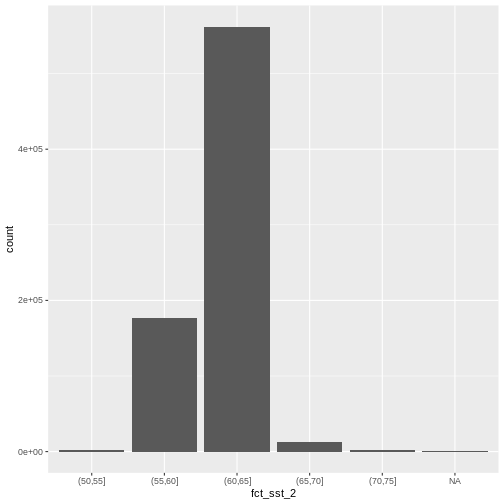
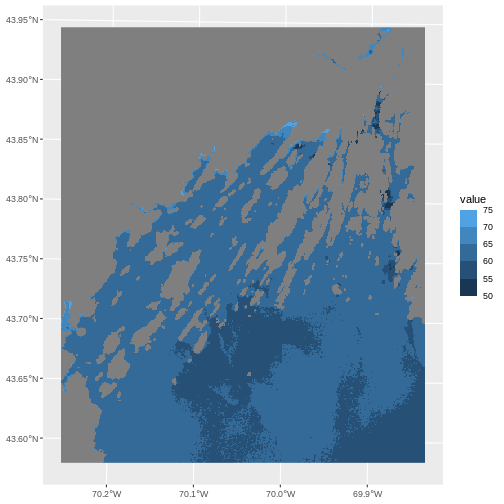
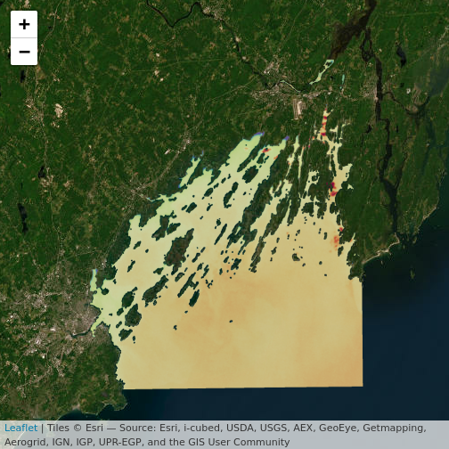

```{.warning}
Warning in
download.file("https://www.naturalearthdata.com/http//www.naturalearthdata.com/download/110m/physical/ne_110m_graticules_all.zip",
: cannot open URL
'https://www.naturalearthdata.com/http//www.naturalearthdata.com/download/110m/physical/ne_110m_graticules_all.zip':
HTTP status was '500 Internal Server Error'
```

```{.error}
Error in download.file("https://www.naturalearthdata.com/http//www.naturalearthdata.com/download/110m/physical/ne_110m_graticules_all.zip", : cannot open URL 'https://www.naturalearthdata.com/http//www.naturalearthdata.com/download/110m/physical/ne_110m_graticules_all.zip'
```

::::::::::::::::::::::::::::::::::::::: objectives

- Build customized plots for a single band raster using the `ggplot2` package.
- Make interactive maps with leaflet

::::::::::::::::::::::::::::::::::::::::::::::::::

:::::::::::::::::::::::::::::::::::::::: questions

- How can I create categorized or customized maps of raster data?
- How can I customize the color scheme of a raster image?
- How can I make my visualizations interactive?

::::::::::::::::::::::::::::::::::::::::::::::::::

First, let's load some libraries. You should have them loaded from the previous less, but in case you don't - 


```r
library(terra)
library(tidyterra)
library(ggplot2)
library(dplyr)
```

We are also going to load one new library.


```r
library(leaflet)
```

To remind you, this is the data we will be using - 


```r
# Learners will have this data loaded from earlier episode
# DSM data for Harvard Forest
b10_casco_2023 <-
  rast("data/landsat_casco/b10_cropped/LC09_L2SP_011030_20230920_20230922_02_T1_ST_B10.TIF") |>
  clamp(lower = 50,
        upper = 75)

b10_casco_2023_df <- as.data.frame(b10_casco_2023, xy = TRUE)
```

::::::::::::::::::::::::::::::::::::::::::  prereq

## Things You'll Need To Complete This Episode

See the [lesson homepage](.) for detailed information about the software,
data, and other prerequisites you will need to work through the examples in this episode.


::::::::::::::::::::::::::::::::::::::::::::::::::

## Plot Raster Data in R

This episode covers how to plot a raster in R using the `ggplot2`
package with customized coloring schemes. We will then make interactive maps with `leaflet`.

We will continue working with the Landsat SST data from Casco Bay.

## Plotting Data Using Breaks

In the previous episode, we viewed our data using a continuous color ramp. For
clarity and visibility of the plot - or if there are classes you are interested in - we may prefer to view the data "symbolized" 
or colored according to ranges of values. This is comparable to a "classified"
map. To do this, we need to tell `ggplot` how many groups to break our data 
into, and where those breaks should be. To make these decisions, it is useful 
to first explore the distribution of the data using a bar plot. To begin with, 
we will use `dplyr`'s `mutate()` function combined with `cut()` to split the 
data into 4 bins.


```r
b10_casco_2023_df <- b10_casco_2023_df %>%
                mutate(fct_sst = cut(SST_F_20230920, breaks = 4))

ggplot() +
    geom_bar(data = b10_casco_2023_df, aes(fct_sst))
```


 
If we want to know the cutoff values for the groups, we can ask for the unique 
values of `fct_sst`:


```r
unique(b10_casco_2023_df$fct_sst)
```

```{.output}
[1] (62.5,68.8] (68.8,75]   (56.2,62.5] (50,56.2]  
Levels: (50,56.2] (56.2,62.5] (62.5,68.8] (68.8,75]
```

And we can get the count of values in each group using `dplyr`'s `group_by()` 
and `count()` functions:


```r
b10_casco_2023_df %>%
        group_by(fct_sst) %>%
        count()
```

```{.output}
# A tibble: 4 × 2
# Groups:   fct_sst [4]
  fct_sst          n
  <fct>        <int>
1 (50,56.2]     2370
2 (56.2,62.5] 657710
3 (62.5,68.8]  92571
4 (68.8,75]     2461
```

We might prefer to customize the cutoff values for these groups.
Lets round the cutoff values so that we have groups for the ranges of
50 – 55F, 55 – 60F, 65 - 70F and 70-75F.
To implement this we will give `mutate()` a numeric vector of break points 
instead of the number of breaks we want.


```r
custom_bins <- c(50, 55, 60, 65, 70, 75)

b10_casco_2023_df <- b10_casco_2023_df %>%
  mutate(fct_sst_2 = cut(SST_F_20230920, breaks = custom_bins))

unique(b10_casco_2023_df$fct_sst_2)
```

```{.output}
[1] (65,70] (70,75] (60,65] (55,60] (50,55] <NA>   
Levels: (50,55] (55,60] (60,65] (65,70] (70,75]
```

`cut()` is a powerful function, and there are a series of related ones that are quite useful.

| function    | what it does |
| -------- | ------- |
| cut  | makes groups based on pre-defined breakpoints    |
| cut_interval | makes n groups with equal range     |
| cut_width    | makes groups with a given width    |
| cut_number    | makes n groups with an equal number of observations    |

Try them out with `b10_casco_2023_df$SST_F_20230920` to see how they differ.

:::::::::::::::::::::::::::::::::::::::::  callout

## Data Tips

Note that when we assign break values a set of 6 values will result in 5 bins 
of data.

The bin intervals are shown using `(` to mean exclusive and `]` to mean 
inclusive. For example: `(65, 70]` means "from 65 through 70".


::::::::::::::::::::::::::::::::::::::::::::::::::

And now we can plot our bar plot again, using the new groups:


```r
ggplot() +
  geom_bar(data = b10_casco_2023_df, 
           mapping = aes(fct_sst_2))
```



And we can get the count of values in each group in the same way we did before:


```r
b10_casco_2023_df %>%
  group_by(fct_sst_2) %>%
  count()
```

```{.output}
# A tibble: 6 × 2
# Groups:   fct_sst_2 [6]
  fct_sst_2      n
  <fct>      <int>
1 (50,55]     1483
2 (55,60]   176310
3 (60,65]   562050
4 (65,70]    13284
5 (70,75]     1715
6 <NA>         270
```

We can use those groups to plot our raster data, with each group being a 
different color. We could do this with our data frame, or, we can use the `scale_color_binned()` color scale. This is a feature of `ggplot2` that lets you create bins on the fly and plot them. We can specify our custom breaks with the `breaks` argument. 


```r
ggplot() +
  geom_spatraster(data = b10_casco_2023) + 
  scale_fill_binned(breaks = custom_bins)
```



A lot of color scales have binned versions. We could have done the above with `scale_fill_viridis_b()`. Or we could place with `scale_fill_fermenter()` which comes from [Color Brewer](https://colorbrewer2.org/). 


```r
ggplot() +
  geom_spatraster(data = b10_casco_2023) + 
  scale_fill_fermenter(breaks = custom_bins,
                       palette = "Accent")
```


Note the choices of palette. ColorBrewer supplies quite a few to try!


```r
RColorBrewer::display.brewer.all() 
```


This is just the tip of the iceberg when looking for color palettes for R, and it's a topic well worth searching out when you want to customize your own plots to the nth degree. You can even make your own custom palette with `scale_fill_stepsn()`.


```r
my_pal <- c("red", "blue", "purple", "orange", "yellow")

ggplot() +
  geom_spatraster(data = b10_casco_2023) + 
  scale_fill_stepsn(breaks = custom_bins,,
                    colors = my_pal)
```


One advantage to this is that you can then use the same breaks and color palette across multiple plots for consistency, rather than having `ggplot2` choose the breaks and palette stretching for you. There are also many wonderful palette packages, like [wesanderson](https://github.com/karthik/wesanderson) or [beyonce](https://github.com/dill/beyonce).

### More Plot Formatting

All labels in a plot can be controlled by the `labs()` function. So, if we wanted to give the fill name "SST (F)", label the X and Y axis, and give this plot a title of "SST on Sept 9, 2023" we can do so easily.


```r
ggplot() +
  geom_spatraster(data = b10_casco_2023) + 
  scale_fill_stepsn(breaks = custom_bins,,
                    colors = my_pal) +
  labs(title = "SST on Sept 9, 2023",
       x = "Longitude", y = "Latitude",
       fill = "SST (F)")
```


We can also retheme the entire plot - changing the background, axis options, and more. If you really want to get deeply into themes, there are many wonderful packages out there like [ggthemes](https://yutannihilation.github.io/allYourFigureAreBelongToUs/ggthemes/), [tvthemes](https://ryo-n7.github.io/tvthemes/), [hrbrthemes](https://cinc.rud.is/web/packages/hrbrthemes/), [ggsci](https://nanx.me/ggsci/), and so many more.

Within ggplot itself, chekc out the different `theme_*()` functions, such as `theme_void()`. We can use the `base_size` argument to specify a base font size as well.


```r
ggplot() +
  geom_spatraster(data = b10_casco_2023) + 
  scale_fill_stepsn(breaks = custom_bins,,
                    colors = my_pal) +
  labs(title = "SST on Sept 9, 2023",
       x = "Longitude", y = "Latitude",
       fill = "SST (F)") +
  theme_void(base_size = 12)
```


You can also make your own custom theme or theme modifications with the `theme()` function. Dig into the `?theme` helpfile to learn more and see examples.

:::::::::::::::::::::::::::::::::::::::  challenge

## Challenge: Plot Using Custom Breaks

Create a plot of the Casco Bay SST in August 2013 that has:

1. Three classified ranges of values (break points) that are evenly divided among 
   the range of pixel values. Any palette you'd like! 
2. Axis labels.
3. A plot title.
4. A unique theme.  

The file is `data/landsat_casco/b10_cropped/LC08_L2SP_011030_20130815_20200912_02_T1_ST_B10.TIF` to remind you.

:::::::::::::::  solution

## Answers


```r
b10_casco_2013 <- rast("data/landsat_casco/b10_cropped/LC08_L2SP_011030_20130815_20200912_02_T1_ST_B10.TIF") 

# find intervals
cut_interval(values(b10_casco_2013), n = 3) |> levels()

# round those intervals into breaks
new_breaks <- c(50, 65, 75, 85)

# plot with these new breaks using Set2 as the palette

ggplot() +
  geom_spatraster(data = b10_casco_2013) + 
  scale_fill_fermenter(breaks = new_breaks,
                    palette = "Set2") +
  labs(title = "SST on Aug 15, 2023",
       x = "Longitude", y = "Latitude",
       fill = "SST (F)") +
  ggthemes::theme_few()
```

:::::::::::::::::

:::::::::::::::::::::::::::::::::::::::::::

## Interactive Maps

These static maps are beautiful, but, they can be difficult if you notice features occurring at small scales you want to investigate. They're also wonderful objects to build for web applications and the like, as they allow users a degree of interactivity.

For a basic level of interactivity - just to explore - `terra` includes a function called `plet()` which lets us look at our raster interactively.


```r
plet(b10_casco_2023)
```


This is great, and we can even put some reference behind it with the `tiles` argument.


```r
plet(b10_casco_2023, tile = "Esri.WorldImagery")
```


What do you learn from this?


:::::::::::::::::::::::::::::::::::::::  challenge

## Challenge: 

1. What does 2013 look like by comparison? Are spatial patterns the same, or different?

2. There are many `tiles` options. Try "Streets" and "OpenTopoMap". Which do you prefer and why?

:::::::::::::::  solution

## Answers


```r
plet(b10_casco_2023, tile = "Street")
```

:::::::::::::::::::::::::

::::::::::::::::::::::::::::::::::::::::::::::::::


:::::::::::::::::::::::::::::::::::::::::  callout

## Data Tips

If you want to make sure things can be seen behind the raster, try fiddling with the `alpha` values. It's set to 0.8 by default The alpha value determines how transparent the colors will be (0 being
transparent, 1 being opaque).

There are other options for `plet` that could be well worth an exploration as you use it to try and understand what is happening in your raster imagery.


::::::::::::::::::::::::::::::::::::::::::::::::::

The above is well and good for exploration, but for presentation you might something more customized. Did you notice in the lowe right-hand corner the word "leaflet"? This is the name of a Javascript library that powers a lot of interactive maps you see on the internet. `plet()` actually calls an R library `leaflet` that then interacts with the Javascript library to make these maps. You can learn a lot more about `leaflet` for R from [here](https://rstudio.github.io/leaflet/).

The `leaflet` library works in some very similar and some very different ways from `ggplot2`. It's useful to know as it allows us to customize the presentation of our maps for a public audience. It works by building a map up in a sequence of layers, like `ggplot2`, except that it uses the pipe to add each new element. For example, to generate the above map, we'd have to first initialize a `leaflet()` map, then `addTiles()`, and finally `addRasterImage()`.


```r
library(leaflet)

leaflet() |>
  addTiles() |>
  addRasterImage(b10_casco_2023)
```


Note that the color palette is different as is the background map from `plet()`. This is all customizable! 

`addTiles()` takes an argument `urlTemplate` which looks a bit odd, but, you can get the arguments for different tilesets from [this site](https://leaflet-extras.github.io/leaflet-providers/preview/index.html).  Or use `addProviderTiles()` to just specify a provider and map.


```r
leaflet() |>
  addProviderTiles("Esri.WorldImagery") |>
  addRasterImage(b10_casco_2023, opacity = 0.8)
```



For colors, we can specify a color mapping - from our raster to a palette. There are four functions for this. `colorNumeric()` is for continuous values. `colorBin()` does what we've been doing with `scale_fill_binned()`. We can use discrete values with `colorFactor()` or if we want to use quantiles (e.g., to highlight 95th percentiles and extremes beyond them), we can use `colorQuantile()`. Each takes a palette, which we can either specify as a vector of colors or a name of a ColorBrewer or Viridis palette. It also takes a domain, the values the palette will be mapped to.

What's great about defining a palette here is that we can then use it for `addLegend()` or for other maps to have equivalent scales. Here's an example using the `RdYlBu` palette. Don't forget to set `na.color = "transparent"` if you don't want to see it.


```r
# note, using reverse = TRUE here as otherwise warm = blue
my_pal <- colorNumeric(palette = "RdYlBu",
                    domain = values(b10_casco_2023),
                    na.color = "transparent",
                    reverse = TRUE)

leaflet() |>
  addTiles() |>
  addRasterImage(b10_casco_2023,
                 colors = my_pal) |>
  addLegend(pal = my_pal, 
            values = values(b10_casco_2023),
            title = "SST (F)")
```


:::::::::::::::::::::::::::::::::::::::  challenge

## Challenge: 

1. Put together a leaflet map of 2013. 
2. Add a tileset that you like.
3. Add colors to make it pop!
4. Look at the arguments for `addLegend()` to move it where you want. If you'd like to go big, check out `addMiniMap()`, `addScaleBar()`, or `addLayersControl()` with multiple tile sets

:::::::::::::::  solution

## Answers


```r
# Let's do bins!
new_pal <- colorBin(palette = "plasma",
                    domain = values(b10_casco_2013),
                    na.color = "transparent")

leaflet() |>
  addProviderTiles("Esri.WorldTerrain") |>
  addProviderTiles("Thunderforest.SpinalMap") |>
  addProviderTiles("Esri.WorldImagery") |>
  addRasterImage(b10_casco_2013,
                 colors = new_pal,
                 opacity = 0.7) |>
  addLegend(pal = new_pal, 
            values = values(b10_casco_2013),
            title = "SST (F)") |>
  addScaleBar("bottomleft") |>
  addLayersControl(position = "bottomright",
                   baseGroups = c("World Terrain", 
                                  "This Is Spinal Map!",
                                  "World Imagery"))
```

:::::::::::::::::::::::::

::::::::::::::::::::::::::::::::::::::::::::::::::


:::::::::::::::::::::::::::::::::::::::: keypoints

- Continuous data ranges can be grouped into categories using `mutate()` and `cut()` or with a binned color scale in `ggplot2`.
- Use built-in color palettes with `scale_fill_viridis_b` or `scale_fill_fermenter()` or set your preferred color scheme manually.
- Interactive plotting with `plet()` and the `leaflet` library can lead to even better insights as you zoom in and out.

::::::::::::::::::::::::::::::::::::::::::::::::::


