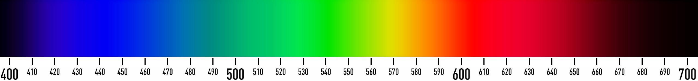
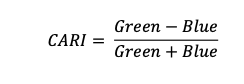

```{.output}
phantomjs has been installed to /home/runner/bin
```

::::::::::::::::::::::::::::::::::::::: objectives

- Perform a math with different raster layers.
- Perform more math using the raster `lapp()` function.
- Export raster data as a GeoTIFF file.

::::::::::::::::::::::::::::::::::::::::::::::::::

:::::::::::::::::::::::::::::::::::::::: questions

- How do I do math on rasters and extract pixel values for defined locations?

::::::::::::::::::::::::::::::::::::::::::::::::::


::::::::::::::::::::::::::::::::::::::::::  prereq

## Things You'll Need To Complete This Episode

See the [lesson homepage](.) for detailed information about the software,
data, and other prerequisites you will need to work through the examples in 
this episode.

You will also need some [new data](https://figshare.com/ndownloader/files/43988577)
that you should unzip and put into the `data/landsat_casco` folder.


::::::::::::::::::::::::::::::::::::::::::::::::::

We often want to combine values of and perform calculations on rasters to 
create a new output raster. This episode covers how to subtract one raster from
another using basic raster math and the `lapp()` function. It also covers 
how to extract pixel values from a set of locations - for example a buffer 
region around plot locations at a field site.

## Raster Calculations in R

We often want to perform calculations on two or more rasters to create a new
output raster. For example, if we are interested in getting the observed 
chlorophyll in the water, we might want to use different Landsat layers to 
calculate an observed value based on published equations. This can help us
identify Suberged Aquatic Vegetation (SAV). The resulting data set might 
show us where seagrass or other vegetation exists. There are two method for this
we will use today from Zhang 2023 and O'Reilly and Werdell in 2019. The first is
a calculation of chlorophyll based on three bands that cover different nm of the
visible spectrum.



Recall from before that the first few bands of Landsat 8 cover the following:
- Band 1 Coastal Aerosol (430 - 450 nm) 30 m
- Band 2 Blue (450 - 510 nm) 30 m
- Band 3 Green (530 - 590 nm) 30 m
- Band 4 Red (640 - 670 nm) 30 m
- Band 5 Near-Infrared (850 - 880 nm) 30 m

To calculate Chla in the water, we will use imagery from Landsat that has been
algorithmically corrected for water - i.e., algorithms that don't just correct
the imagery for things in the atmosphere, but that literally try their best to
correct for all of the spectral properties of what is in the water. We are going
to use three bands from a Landsat scene in winter of 2023, as phytoplankton is
at a low and we are more likely to see what is on the seafloor. The imagery has
been corrected using [ACOLITE](https://odnature.naturalsciences.be/remsem/software-and-data/acolite). With the three bands, in units of Rrs - in essence water leaving irradiance / downwellign irradiance. To learn more, [see here](https://www.oceanopticsbook.info/view/inherent-and-apparent-optical-properties/reflectances).


Where those a coefficients come from [NASA Algorithms](https://www.earthdata.nasa.gov/apt/documents/chlor-a/v1.0#mathematical_theory). Those three wavelengths correspond to the coastal band, the green band, 
and the blue band.

The second method is a bit simpler. It's called the Chlorophyll Absorption 
Ratio Index (CARI).


Let's see how simple it is to make these work for us!


:::::::::::::::::::::::::::::::::::::::::  callout

## More Resources

- [Chlorophyll A algorithms](https://www.earthdata.nasa.gov/apt/documents/chlor-a/v1.0#mathematical_theory) and NASA Earthdata. 

- O’Reilly, J. E., & Werdell, P. J. (2019). Chlorophyll algorithms for ocean color sensors-OC4, OC5 & OC6. [https://doi.org/10.1016/j.rse.2019.04.021](https://doi.org/10.1016/j.rse.2019.04.021)

::::::::::::::::::::::::::::::::::::::::::::::::::

### Load Libraries and Pre-Process the Data


For this episode, we will use the Landsat scene from 2023 and the seagrass beds
from Casco Bay in 2022 (we'll assume they're close enough to 2023). Let's start
by loading `terra`, `sf`, and `ggplot2`.


```r
library(terra)
library(sf)
library(ggplot2)
library(tidyterra)
```

Next, let's load our two different data sources. We will load the rasters into
one stack for ease of use. We will also load the Casco AOI and Maine State
borders for use in cropping and masking down to just water.


```r
#ACOLITE corrected Rrs
landsat_files <- list.files(
  "data/landsat_casco/L8_OLI_2023_02_07_15_27_04_012030_L2R/",
           pattern = "tif",
           full.names = TRUE)

# we only want files 3 through 5 - coastal, blue, and green
landsat_layers <- rast(landsat_files)
```

```{.error}
Error: [rast] filename is empty. Provide a valid filename
```

```r
# give the layers better names
names(landsat_layers) <- c("blue_443", "blue_483", "green_561")
```

```{.error}
Error: object 'landsat_layers' not found
```

```r
# load our shapefile
seagrass_casco_2022 <- st_read(
  "data/maine_gov_seagrass/MaineDEP_Casco_Bay_Seagrass_2022/MaineDEP_Casco_Bay_Seagrass_2022.shp")

# Load files for processing
aoi_boundary_casco <- st_read(
  "data/maine_gov_maps/casco_aoi/casco_bay_aoi.shp")

maine_borders <- st_read(
  "data/maine_gov_maps/Maine_State_Boundary_Polygon_Feature/Maine_State_Boundary_Polygon_Feature.shp")
```


:::::::::::::::::::::::::::::::::::::::  challenge

## Exercise

1. Look at the information about the Landsat raster and shapefiles. Are they 
similar or different?

2. If we want to just look at the Casco Bay region of the Landsat data, 
what types of spatial operations will we have to execute to make this work?


:::::::::::::::  solution

## Solution


```r
describe(sources(landsat_layers))
```

```{.error}
Error in h(simpleError(msg, call)): error in evaluating the argument 'x' in selecting a method for function 'describe': error in evaluating the argument 'x' in selecting a method for function 'sources': object 'landsat_layers' not found
```

```r
seagrass_casco_2022
```

```{.output}
Simple feature collection with 622 features and 15 fields
Geometry type: POLYGON
Dimension:     XY
Bounding box:  xmin: -70.24464 ymin: 43.57213 xmax: -69.84399 ymax: 43.93221
Geodetic CRS:  WGS 84
First 10 features:
   OBJECTID Id Name       Acres   Hectares Orth_Cover Cover_Pct Field_Ver
1         1  1   01  0.04456005 0.01803281          1      0-10         Y
2         2  4   02  0.06076669 0.02459141          3     40-70         Y
3         3  6   03  2.56218247 1.03687846          3     40-70         Y
4         4  8   05  0.71816162 0.29062970          3     40-70         Y
5         5  9   06  0.01815022 0.00734513          3     40-70         Y
6         6 10   07  0.33051475 0.13375458          3     40-70         Y
7         7 11   08  0.08088664 0.03273366          1      0-10         Y
8         8 13   09  0.66689055 0.26988103          1      0-10         Y
9         9 14   10  0.03080650 0.01246695          3     40-70         Y
10       10 15   11 12.54074080 5.07505774          4    70-100         Y
   Video_YN                          Video Comment        Species
1         Y                            A03    <NA> Zostera marina
2         Y                            A04    <NA> Zostera marina
3         Y                            A05    <NA> Zostera marina
4         Y                            A07    <NA> Zostera marina
5         Y                            A08    <NA> Zostera marina
6         Y                            A09    <NA> Zostera marina
7         Y                            A10    <NA> Zostera marina
8         Y                            A11    <NA> Zostera marina
9         Y                            A12    <NA> Zostera marina
10        Y A14, A15, A16, A17, SP07, SP08    <NA> Zostera marina
                                 GlobalID  ShapeSTAre ShapeSTLen
1  {7CAB9D54-4BF9-4B91-94D6-4F0EA4AD53C1}   180.32842  102.57257
2  {D5396F39-D508-45CB-BFE0-13A506D4E94C}   245.91500   84.35420
3  {3C1ED4DC-6580-4CAC-9499-32D445019068} 10368.78375  719.04025
4  {6C1395B8-F532-46C6-AFBA-23B14C2F2E02}  2906.29561  315.88722
5  {EDEDAFA1-8605-4FAC-910F-E6E864F51209}    73.45108   34.00204
6  {820DE3B5-BA6E-4415-A110-95F9F94A4F1C}  1337.54527  165.98655
7  {E4E2A155-7B1C-46C3-94B5-6D0E58B1FEBB}   327.33664  112.52478
8  {C7FEF8AC-9BA7-429C-A45B-270E836FBBA1}  2698.81099  295.01388
9  {356C58A4-DB72-445F-83DA-1035C8EAE917}   124.66947   43.47523
10 {C797140E-F9CB-4EA0-9D7C-FBEA50FE9EB2} 50750.58217 1949.02908
                         geometry
1  POLYGON ((-70.20081 43.5722...
2  POLYGON ((-70.20228 43.5869...
3  POLYGON ((-70.20858 43.5909...
4  POLYGON ((-70.21488 43.5924...
5  POLYGON ((-70.21499 43.5931...
6  POLYGON ((-70.21582 43.5963...
7  POLYGON ((-70.21618 43.5964...
8  POLYGON ((-70.21641 43.5971...
9  POLYGON ((-70.21498 43.6063...
10 POLYGON ((-70.22445 43.6425...
```

Different in CRS and extent. We will have to project and crop.

:::::::::::::::::::::::::

::::::::::::::::::::::::::::::::::::::::::::::::::

So, we have to get Landsat into the same CRS as our Maine data. We will then
have to crop it down to the Casco region. This is actually one of those cases
where it will be faster to reproject the vectors than the raster for 
the cropping.


```r
aoi_boundary_casco_projected <- st_transform(aoi_boundary_casco,
                                             crs(landsat_layers))
```

```{.error}
Error in h(simpleError(msg, call)): error in evaluating the argument 'x' in selecting a method for function 'crs': object 'landsat_layers' not found
```

```r
landsat_layers_casco <- crop(landsat_layers,
                             aoi_boundary_casco_projected)
```

```{.error}
Error in h(simpleError(msg, call)): error in evaluating the argument 'x' in selecting a method for function 'crop': object 'landsat_layers' not found
```

```r
landsat_layers_casco <- project(landsat_layers_casco, 
                                crs(seagrass_casco_2022))
```

```{.error}
Error in h(simpleError(msg, call)): error in evaluating the argument 'x' in selecting a method for function 'project': object 'landsat_layers_casco' not found
```

## Masking Out Land with a Vector

Let's see what we have after the cropping.


```r
ggplot() +
  geom_spatraster(data = landsat_layers_casco) +
  facet_wrap(~lyr) +
  scale_fill_distiller(palette = "Greys")
```

```{.error}
Error in eval(expr, envir, enclos): object 'landsat_layers_casco' not found
```

This is neat, but...... it's dominated by the land. We want to mask the land.
Otherwise, the signal is going to be dominated by land and not sea. Fortunately,
we can use the coastline of the state from the maine shapefile with `mask()`. 
By default, mask keeps what is IN polygons. So we will need to use the argument
`inverse = TRUE`. We also need our coastline to have the same extent as our 
raster, so, we'll need to crop it first. 

We will also recrop to the AOI again, as our previous crop leaves some cruft around the edges.


```r
casco_coastline <- st_crop(maine_borders |> st_make_valid(), 
                           aoi_boundary_casco) 
```

```{.warning}
Warning: attribute variables are assumed to be spatially constant throughout
all geometries
```

```r
# mask and crop
landsat_layers_casco_bay <- mask(landsat_layers_casco,
                                 casco_coastline,
                                 inverse = TRUE) |> 
  crop(aoi_boundary_casco)
```

```{.error}
Error in h(simpleError(msg, call)): error in evaluating the argument 'x' in selecting a method for function 'crop': error in evaluating the argument 'x' in selecting a method for function 'mask': object 'landsat_layers_casco' not found
```

Did it blend?


```r
ggplot() +
  geom_spatraster(data = landsat_layers_casco_bay ) +
  facet_wrap(~lyr) +
  scale_fill_distiller(palette = "Greys", na.value = NA)
```

```{.error}
Error in eval(expr, envir, enclos): object 'landsat_layers_casco_bay' not found
```

This looks great. There are still some really really high and low values. We might want to figure out a threshold for clamping. Looking at the histogram below, something like 0.02 for the upper seems reasonable. We will
use `values=FALSE` to just remove very high values and make them NA.


```r
hist(landsat_layers_casco_bay, breaks = 100, xlim = c(0,0.02))
```

```{.error}
Error in h(simpleError(msg, call)): error in evaluating the argument 'x' in selecting a method for function 'hist': object 'landsat_layers_casco_bay' not found
```

```r
landsat_layers_casco_bay <- clamp(landsat_layers_casco_bay,
                                   lower = 0,
                                   upper = 0.02,
                                   value = FALSE)
```

```{.error}
Error in h(simpleError(msg, call)): error in evaluating the argument 'x' in selecting a method for function 'clamp': object 'landsat_layers_casco_bay' not found
```

Replot it, and, wow, you can really start to see some variability

## Two Ways to Perform Raster Calculations

We can calculate with  rasters in two different ways:

- by directly using the rasters in R using raster math

or for more efficient processing - particularly if our rasters are large and/or
the calculations we are performing are complex:

- using the `lapp()` function.

## Raster Math \& CARI

We can perform raster calculations by subtracting (or adding,
multiplying, etc) two rasters. In the geospatial world, we call this
"raster math".

Let's calculate (green - blue)/(green + blue) to get our CARI score.
After doing this, let's  plot with `ggplot`.


```r
casco_cari <- (landsat_layers_casco_bay$green_561 - landsat_layers_casco_bay$blue_483) /
  (landsat_layers_casco_bay$green_561 + landsat_layers_casco_bay$blue_483) 
```

```{.error}
Error in eval(expr, envir, enclos): object 'landsat_layers_casco_bay' not found
```

```r
names(casco_cari) <- "CARI"
```

```{.error}
Error: object 'casco_cari' not found
```

```r
ggplot() +
  geom_spatraster(data = casco_cari) +
  scale_fill_viridis_c() +
  labs(fill = "CARI")
```

```{.error}
Error in eval(expr, envir, enclos): object 'casco_cari' not found
```


Let's have a look at the distribution of values in our newly created
CARI Model (CHM).


```r
hist(casco_cari,
     maxcell = ncell(casco_cari))
```

```{.error}
Error in h(simpleError(msg, call)): error in evaluating the argument 'x' in selecting a method for function 'hist': object 'casco_cari' not found
```

We are definitely starting to see some coastal features here, although whether
it is chlorophyll or just coastal runoff is unclear.

:::::::::::::::::::::::::::::::::::::::  challenge

## Challenge: Explore CHM Raster Values

It's often a good idea to explore the range of values in a raster dataset just 
like we might explore a dataset that we collected in the field. Or the 
spatial distribution to see if it lines up with expectations.

1. Zoom in on an island (Mackworth if you like). What does the spatial 
distribution look like? Use `ggplot2` or `leaflet`.

2. Overlay the seagrass bed shapefile. What do you see?

:::::::::::::::  solution

## Answers

1) Zooming in, some of the highest values are close to shorelines.


```r
library(leaflet)

leaflet() |>
  addTiles() |>
  addRasterImage(x = casco_cari)
```

```{.error}
Error in eval(expr, envir, enclos): object 'casco_cari' not found
```

2) 


```r
library(leaflet)

pal <- colorNumeric("viridis", values(casco_cari), na.color = NA)
```

```{.error}
Error in h(simpleError(msg, call)): error in evaluating the argument 'x' in selecting a method for function 'values': object 'casco_cari' not found
```

```r
leaflet() |>
  addTiles() |>
  addRasterImage(x = casco_cari,
                 colors = pal) |>
  addPolygons(data = seagrass_casco_2022,
               color = "black",
               weight = 1) |>
  addLegend(pal = pal, values = values(casco_cari))
```

```{.error}
Error in h(simpleError(msg, call)): error in evaluating the argument 'x' in selecting a method for function 'values': object 'casco_cari' not found
```

:::::::::::::::::::::::::

::::::::::::::::::::::::::::::::::::::::::::::::::

## Efficient Raster Calculations

Raster math, like we just did, is an appropriate approach to raster calculations
if:

1. The rasters we are using are small in size.
2. The calculations we are performing are simple.

However, raster math is a less efficient approach as computation becomes more
complex or as file sizes become large.

The `lapp()` function takes two or more rasters and applies a function to
them using efficient processing methods. The syntax is

`outputRaster <- lapp(x, fun=functionName)`

In which raster can be either a SpatRaster or a SpatRasterDataset which is an 
object that holds rasters. See `help(sds)`. 

If you have a raster, stack, you can instead use `app()`

`outputRaster <- app(x, fun=functionName)`


:::::::::::::::::::::::::::::::::::::::::  callout

## Data Tip

To create a SpatRasterDataset, we call the function `sds` which can take a list 
of raster objects (each one created by calling `rast`).

::::::::::::::::::::::::::::::::::::::::::::::::::

Let's perform the chla calculation that we calculated above using
raster math, using the `app()` function.

:::::::::::::::::::::::::::::::::::::::::  callout

## Data Tip

A custom function consists of a defined set of commands performed on a input 
object. Custom functions are particularly useful for tasks that need to be 
repeated over and over in the code. A simplified syntax for writing a custom 
function in R is:
`function_name <- function(variable1, variable2) { WhatYouWantDone, WhatToReturn}`


::::::::::::::::::::::::::::::::::::::::::::::::::


```r
get_chl <- function(rast_stack){
  
  #eqn 3.1
  x <- log10(max(rast_stack[1], rast_stack[2])/rast_stack[3])
  
  #eqn 3.2
  10^(0.30963 + -2.40052*x + 1.28932*x^2 + 0.52802*x^3 + -1.33825*x^4) 
  }

casco_chla <- app(landsat_layers_casco_bay, 
                    fun = get_chl)
```

```{.error}
Error in h(simpleError(msg, call)): error in evaluating the argument 'x' in selecting a method for function 'app': object 'landsat_layers_casco_bay' not found
```

```r
names(casco_chla) <- "chla"
```

```{.error}
Error: object 'casco_chla' not found
```

Now we can plot the CHLa:


```r
 ggplot() +
   geom_spatraster(data = casco_chla) + 
  scale_fill_viridis_c() +
  labs(fill = "Chl a")
```

```{.error}
Error in eval(expr, envir, enclos): object 'casco_chla' not found
```

How do the plots of the CHM created with manual raster math and the `lapp()`
function compare?

:::::::::::::::::::::::::::::::::::::::  challenge

## Challenge: Explore CHM Raster Values

How does Chla compare to CARI? Check it out with `leaflet()`

::::::::::::::: solution

Qualitatively, they look about the same!


```r
library(leaflet)

pal_chl <- colorNumeric("viridis", values(casco_chla), na.color = NA)
```

```{.error}
Error in h(simpleError(msg, call)): error in evaluating the argument 'x' in selecting a method for function 'values': object 'casco_chla' not found
```

```r
leaflet() |>
  addTiles() |>
  addRasterImage(x = casco_chla,
                 colors = pal_chl) |>
  addPolygons(data = seagrass_casco_2022,
               color = "black",
               weight = 2,
              fill = NA) |>
  addLegend(pal = pal_chl, values = values(casco_chla))
```

```{.error}
Error in h(simpleError(msg, call)): error in evaluating the argument 'x' in selecting a method for function 'values': object 'casco_chla' not found
```

:::::::::::::::
:::::::::::::::::::::::::::::::::::::::  
## Export a GeoTIFF

Now that we've created a new raster, let's export the data as a GeoTIFF
file using
the `writeRaster()` function.

When we write this raster object to a GeoTIFF file we'll name it
`casco_cari.tif`. This name allows us to quickly remember both what the data
contains (CARI data) and for where (Casco bay). The `writeRaster()` function
by default writes the output file to your working directory unless you specify a
full file path.

We will specify the output format ("GTiff"), the no data value `NAflag = -9999`. 
We will also tell R to overwrite any data that is already in a file of the same 
name.


```r
writeRaster(casco_cari, "data/casco_cari.tif",
            filetype="GTiff",
            overwrite=TRUE,
            NAflag=-9999)
```

### writeRaster() Options

The function arguments that we used above include:

- **filetype:** specify that the format will be `GTiff` or GeoTIFF.
- **overwrite:** If TRUE, R will overwrite any existing file  with the same
  name in the specified directory. USE THIS SETTING WITH CAUTION!
- **NAflag:** set the GeoTIFF tag for `NoDataValue` to -9999, the National
  Ecological Observatory Network's (NEON) standard `NoDataValue`.


:::::::::::::::::::::::::::::::::::::::: keypoints

- Rasters can be computed on using mathematical functions.
- The `lapp()` and `app()` function provides an efficient way to do raster math.
- The `writeRaster()` function can be used to write raster data to a file.

::::::::::::::::::::::::::::::::::::::::::::::::::


