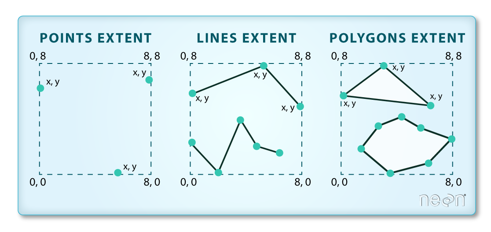

::::::::::::::::::::::::::::::::::::::: objectives

- Know the difference between point, line, and polygon vector elements.
- Load point, line, and polygon vector layers into R.
- Access the attributes of a spatial object in R.

::::::::::::::::::::::::::::::::::::::::::::::::::

:::::::::::::::::::::::::::::::::::::::: questions

- How can I distinguish between and visualize point, line and polygon vector data?

::::::::::::::::::::::::::::::::::::::::::::::::::

First, some libraries you might not have loaded at the moment. 


```r
library(terra)
library(ggplot2)
library(dplyr)
library(sf)
```

::::::::::::::::::::::::::::::::::::::::::  prereq

## Things You'll Need To Complete This Episode

See the [lesson homepage](.) for detailed information about the software, data,
and other prerequisites you will need to work through the examples in this
episode.


::::::::::::::::::::::::::::::::::::::::::::::::::

Starting with this episode, we will be moving from working with raster data to
working with vector data. In this episode, we will open and plot point, line
and polygon vector data loaded from ESRI's `shapefile` format into R. These data refer to data from the [Maine GeoLibrary Data Catalogue](https://www.maine.gov/geolib/catalog.html) on seagrass beds, public roads, and boat launches. In later episodes, we
will learn how to work with raster and vector data together and combine them
into a single plot.

## Import Vector Data

We will use the `sf` package to work with vector data in R. We will also use
the `terra` package, which has been loaded in previous episodes, so we can
explore raster and vector spatial metadata using similar commands. Make sure
you have the `sf` library loaded.


```r
library(sf)
```

The vector layers that we will import from ESRI's `shapefile` format are:

- A polygon vector layer representing our field site boundary,
- A line vector layer representing the public roads of Maine, and
- A point vector layer representing the location of the boat launches around Maine.

The first vector layer that we will open contains the boundary of our study area
(or our Area Of Interest or AOI, hence the name `aoiBoundary`). To import
a vector layer from an ESRI `shapefile` we use the `sf` function `st_read()`. `st_read()`
requires the file path to the ESRI `shapefile`.

Let's import our AOI:


```r
aoi_boundary_casco <- st_read(
  "data/maine_gov_maps/casco_aoi/casco_bay_aoi.shp")
```

```{.output}
Reading layer `casco_bay_aoi' from data source 
  `/home/runner/work/r-raster-vector-geospatial/r-raster-vector-geospatial/site/built/data/maine_gov_maps/casco_aoi/casco_bay_aoi.shp' 
  using driver `ESRI Shapefile'
Simple feature collection with 1 feature and 1 field
Geometry type: POLYGON
Dimension:     XY
Bounding box:  xmin: -70.2528 ymin: 43.5834 xmax: -69.8387 ymax: 43.9439
Geodetic CRS:  WGS 84
```

## Vector Layer Metadata \& Attributes

When we import the `casco_bay_aoi.shp` vector layer from an ESRI `shapefile` into R (as our
`aoi_boundary_casco` object), the `st_read()` function automatically stores
information about the data. We are particularly interested in the geospatial
metadata, describing the format, CRS, extent, and other components of the
vector data, and the attributes which describe properties associated with each
individual vector object.

:::::::::::::::::::::::::::::::::::::::::  callout

## Data Tip

The [Explore and Plot by Vector Layer Attributes](07-vector-shapefile-attributes-in-r/)
episode provides more information on both metadata and attributes
and using attributes to subset and plot data.


::::::::::::::::::::::::::::::::::::::::::::::::::

## Spatial Metadata

Key metadata for all vector layers includes:

1. **Object Type:** the class of the imported object.
2. **Coordinate Reference System (CRS):** the projection of the data.
3. **Extent:** the spatial extent (i.e. geographic area that the vector layer
   covers) of the data. Note that the spatial extent for a vector layer
   represents the combined extent for all individual objects in the vector layer.

We can view metadata of a vector layer using the `st_geometry_type()`, `st_crs()` and
`st_bbox()` functions. First, let's view the geometry type for our AOI
vector layer:


```r
st_geometry_type(aoi_boundary_casco)
```

```{.output}
[1] POLYGON
18 Levels: GEOMETRY POINT LINESTRING POLYGON MULTIPOINT ... TRIANGLE
```

Our `aoi_boundary_casco` is a polygon spatial object. The 18 levels shown below our
output list the possible categories of the geometry type. Now let's check what
CRS this file data is in:


```r
st_crs(aoi_boundary_casco)
```

```{.output}
Coordinate Reference System:
  User input: WGS 84 
  wkt:
GEOGCRS["WGS 84",
    DATUM["World Geodetic System 1984",
        ELLIPSOID["WGS 84",6378137,298.257223563,
            LENGTHUNIT["metre",1]]],
    PRIMEM["Greenwich",0,
        ANGLEUNIT["degree",0.0174532925199433]],
    CS[ellipsoidal,2],
        AXIS["latitude",north,
            ORDER[1],
            ANGLEUNIT["degree",0.0174532925199433]],
        AXIS["longitude",east,
            ORDER[2],
            ANGLEUNIT["degree",0.0174532925199433]],
    ID["EPSG",4326]]
```

Our data in the CRS **WGS 84** (it is EPSG code 4326). The CRS is critical to interpreting the spatial object's extent values as it specifies units. To find the extent of our AOI, we can use the `st_bbox()` function:


```r
st_bbox(aoi_boundary_casco)
```

```{.output}
    xmin     ymin     xmax     ymax 
-70.2528  43.5834 -69.8387  43.9439 
```

The spatial extent of a vector layer or R spatial object represents the geographic
"edge" or location that is the furthest north, south east and west. Thus it
represents the overall geographic coverage of the spatial object. Image Source:
National Ecological Observatory Network (NEON).

{alt='Extent image'}

Lastly, we can view all of the metadata and attributes for this R spatial
object by printing it to the screen:


```r
aoi_boundary_casco
```

```{.output}
Simple feature collection with 1 feature and 1 field
Geometry type: POLYGON
Dimension:     XY
Bounding box:  xmin: -70.2528 ymin: 43.5834 xmax: -69.8387 ymax: 43.9439
Geodetic CRS:  WGS 84
  FID                       geometry
1   0 POLYGON ((-70.2528 43.5834,...
```

## Spatial Data Attributes

We introduced the idea of spatial data attributes in
[an earlier lesson](https://cobalt-casco.github.io/organization-geospatial/02-intro-vector-data).
Now we will explore how to use spatial data attributes stored in our data to
plot different features.

## Plot a vector layer

Next, let's visualize the data in our `sf` object using the `ggplot` package.
Unlike with raster data, we do not need to convert vector data to a dataframe
before plotting with `ggplot`.

We're going to customize our boundary plot by setting the size, color, and fill
for our plot. When plotting `sf` objects with `ggplot2`, you need to use the
`coord_sf()` coordinate system.


```r
ggplot() +
  geom_sf(data = aoi_boundary_casco, linewidth = 3, 
          color = "black", fill = "lightblue") +
  ggtitle("Casco Bay AOI Boundary Plot") +
  coord_sf()
```


:::::::::::::::::::::::::::::::::::::::  challenge

## Challenge: Import Line and Point Vector Layers

Using the steps above, import the MaineDOT_Public_Roads and Maine_Boat_Launches_GeoLibrary vector layers into
R. Call the MaineDOT_Public_Roads object `roads_maine` and the Maine_Boat_Launches_GeoLibrary
`boatlaunches_maine`.

Answer the following questions:

1. What type of R spatial object is created when you import each layer?

2. What is the CRS and extent for each object?

3. Do the files contain points, lines, or polygons?

4. How many spatial objects are in each file?

:::::::::::::::  solution

## Answers

First we import the data:


```r
roads_maine <- st_read("data/maine_gov_maps/MaineDOT_Public_Roads/MaineDOT_Public_Roads.shp")
```

```{.output}
Reading layer `MaineDOT_Public_Roads' from data source 
  `/home/runner/work/r-raster-vector-geospatial/r-raster-vector-geospatial/site/built/data/maine_gov_maps/MaineDOT_Public_Roads/MaineDOT_Public_Roads.shp' 
  using driver `ESRI Shapefile'
Simple feature collection with 100669 features and 30 fields
Geometry type: LINESTRING
Dimension:     XY
Bounding box:  xmin: -71.04662 ymin: 43.06728 xmax: -66.95202 ymax: 47.35999
Geodetic CRS:  WGS 84
```

```r
boatlaunches_maine <- st_read("data/maine_gov_maps/Maine_Boat_Launches_GeoLibrary/Maine_Boat_Launches_GeoLibrary.shp")
```

```{.output}
Reading layer `Maine_Boat_Launches_GeoLibrary' from data source 
  `/home/runner/work/r-raster-vector-geospatial/r-raster-vector-geospatial/site/built/data/maine_gov_maps/Maine_Boat_Launches_GeoLibrary/Maine_Boat_Launches_GeoLibrary.shp' 
  using driver `ESRI Shapefile'
Simple feature collection with 578 features and 20 fields
Geometry type: POINT
Dimension:     XY
Bounding box:  xmin: -70.9817 ymin: 43.0859 xmax: -66.9838 ymax: 47.35484
Geodetic CRS:  WGS 84
```

Then we check its class:


```r
class(roads_maine)
```

```{.output}
[1] "sf"         "data.frame"
```

```r
class(boatlaunches_maine)
```

```{.output}
[1] "sf"         "data.frame"
```

We also check the CRS and extent of each object:


```r
st_crs(roads_maine)
```

```{.output}
Coordinate Reference System:
  User input: WGS 84 
  wkt:
GEOGCRS["WGS 84",
    DATUM["World Geodetic System 1984",
        ELLIPSOID["WGS 84",6378137,298.257223563,
            LENGTHUNIT["metre",1]]],
    PRIMEM["Greenwich",0,
        ANGLEUNIT["degree",0.0174532925199433]],
    CS[ellipsoidal,2],
        AXIS["latitude",north,
            ORDER[1],
            ANGLEUNIT["degree",0.0174532925199433]],
        AXIS["longitude",east,
            ORDER[2],
            ANGLEUNIT["degree",0.0174532925199433]],
    ID["EPSG",4326]]
```

```r
st_bbox(roads_maine)
```

```{.output}
     xmin      ymin      xmax      ymax 
-71.04662  43.06728 -66.95202  47.35999 
```

```r
st_crs(boatlaunches_maine)
```

```{.output}
Coordinate Reference System:
  User input: WGS 84 
  wkt:
GEOGCRS["WGS 84",
    DATUM["World Geodetic System 1984",
        ELLIPSOID["WGS 84",6378137,298.257223563,
            LENGTHUNIT["metre",1]]],
    PRIMEM["Greenwich",0,
        ANGLEUNIT["degree",0.0174532925199433]],
    CS[ellipsoidal,2],
        AXIS["latitude",north,
            ORDER[1],
            ANGLEUNIT["degree",0.0174532925199433]],
        AXIS["longitude",east,
            ORDER[2],
            ANGLEUNIT["degree",0.0174532925199433]],
    ID["EPSG",4326]]
```

```r
st_bbox(boatlaunches_maine)
```

```{.output}
     xmin      ymin      xmax      ymax 
-70.98170  43.08590 -66.98380  47.35484 
```

To see the number of objects in each file, we can look at the output from when
we read these objects into R. `roads_maine` contains 100669 features (all lines) and
`boatlaunches_maine` contains 578 points.


:::::::::::::::::::::::::

::::::::::::::::::::::::::::::::::::::::::::::::::


:::::::::::::::::::::::::::::::::::::::: keypoints

- Metadata for vector layers include geometry type, CRS, and extent.
- Load spatial objects into R with the `st_read()` function.
- Spatial objects can be plotted directly with `ggplot` using the `geom_sf()`
  function. No need to convert to a dataframe.

::::::::::::::::::::::::::::::::::::::::::::::::::


