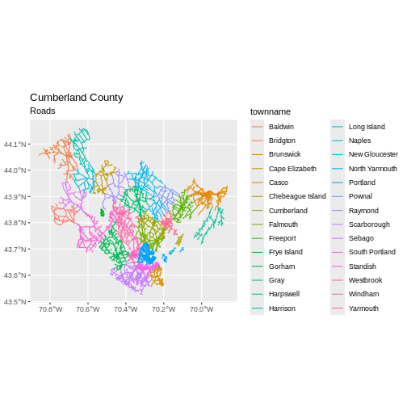
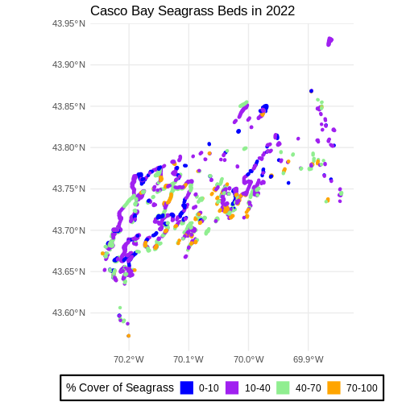
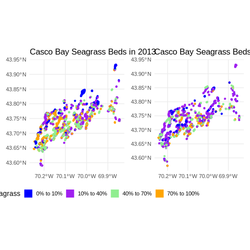

::::::::::::::::::::::::::::::::::::::: objectives

- Query attributes of a spatial object.
- Subset spatial objects using specific attribute values.
- Plot a vector feature, colored by unique attribute values.

::::::::::::::::::::::::::::::::::::::::::::::::::

:::::::::::::::::::::::::::::::::::::::: questions

- How can I compute on the attributes of a spatial object?

::::::::::::::::::::::::::::::::::::::::::::::::::


::::::::::::::::::::::::::::::::::::::::::  prereq

## Things You'll Need To Complete This Episode

See the [lesson homepage](.) for detailed information about the software, data,
and other prerequisites you will need to work through the examples in this
episode.

::::::::::::::::::::::::::::::::::::::::::::::::::

This episode continues our discussion of vector layer attributes and covers how
to work with vector layer attributes in R. It covers how to identify and query
layer attributes, as well as how to subset features by specific attribute
values. Finally, we will learn how to plot a feature according to a set of
attribute values. We will do this looking at data regarding [Seagrass beds in Casco Bay from 2022](https://maine.hub.arcgis.com/datasets/ca6961a5e23e47cebf4d0370d3e493a0) provided by the Maine DEP. For full metadata, [see here](https://www.arcgis.com/sharing/rest/content/items/ca6961a5e23e47cebf4d0370d3e493a0/info/metadata/metadata.xml?format=default&output=html).


## Load the Data

We will continue using the `sf` and `ggplot2` packages in this
episode. Make sure that you have these packages loaded.


```r
library(ggplot2)
library(dplyr)
library(sf)
```
 We will continue to
work with the ESRI `shapefiles` (vector layers). Let's start looking at 
seagrass beds around Casco Bay from 2022.


```r
# seagrass in 2022
seagrass_casco_2022 <- st_read(
  "data/maine_gov_seagrass/MaineDEP_Casco_Bay_Seagrass_2022/MaineDEP_Casco_Bay_Seagrass_2022.shp")
```

## Query Vector Feature Metadata

As we discussed in the
[Open and Plot Vector Layers in R](06-vector-open-shapefile-in-r/)
episode, we can view metadata associated with an R object using:

- `st_geometry_type()` - The type of vector data stored in the object.
- `nrow()` - The number of features in the object
- `st_bbox()` - The spatial extent (geographic area covered by)
  of the object.
- `st_crs()` - The CRS (spatial projection) of the data.

We started to explore our `seagrass_casco_2022` object To see a
summary of all of the metadata associated with our `seagrass_casco_2022` object, 
we can view the object with `View(seagrass_casco_2022)` or print a summary of 
the object itself to the console.


```r
seagrass_casco_2022
```

```{.output}
Simple feature collection with 622 features and 15 fields
Geometry type: POLYGON
Dimension:     XY
Bounding box:  xmin: -70.24464 ymin: 43.57213 xmax: -69.84399 ymax: 43.93221
Geodetic CRS:  WGS 84
First 10 features:
   OBJECTID Id Name       Acres   Hectares Orth_Cover Cover_Pct Field_Ver
1         1  1   01  0.04456005 0.01803281          1      0-10         Y
2         2  4   02  0.06076669 0.02459141          3     40-70         Y
3         3  6   03  2.56218247 1.03687846          3     40-70         Y
4         4  8   05  0.71816162 0.29062970          3     40-70         Y
5         5  9   06  0.01815022 0.00734513          3     40-70         Y
6         6 10   07  0.33051475 0.13375458          3     40-70         Y
7         7 11   08  0.08088664 0.03273366          1      0-10         Y
8         8 13   09  0.66689055 0.26988103          1      0-10         Y
9         9 14   10  0.03080650 0.01246695          3     40-70         Y
10       10 15   11 12.54074080 5.07505774          4    70-100         Y
   Video_YN                          Video Comment        Species
1         Y                            A03    <NA> Zostera marina
2         Y                            A04    <NA> Zostera marina
3         Y                            A05    <NA> Zostera marina
4         Y                            A07    <NA> Zostera marina
5         Y                            A08    <NA> Zostera marina
6         Y                            A09    <NA> Zostera marina
7         Y                            A10    <NA> Zostera marina
8         Y                            A11    <NA> Zostera marina
9         Y                            A12    <NA> Zostera marina
10        Y A14, A15, A16, A17, SP07, SP08    <NA> Zostera marina
                                 GlobalID  ShapeSTAre ShapeSTLen
1  {7CAB9D54-4BF9-4B91-94D6-4F0EA4AD53C1}   180.32842  102.57257
2  {D5396F39-D508-45CB-BFE0-13A506D4E94C}   245.91500   84.35420
3  {3C1ED4DC-6580-4CAC-9499-32D445019068} 10368.78375  719.04025
4  {6C1395B8-F532-46C6-AFBA-23B14C2F2E02}  2906.29561  315.88722
5  {EDEDAFA1-8605-4FAC-910F-E6E864F51209}    73.45108   34.00204
6  {820DE3B5-BA6E-4415-A110-95F9F94A4F1C}  1337.54527  165.98655
7  {E4E2A155-7B1C-46C3-94B5-6D0E58B1FEBB}   327.33664  112.52478
8  {C7FEF8AC-9BA7-429C-A45B-270E836FBBA1}  2698.81099  295.01388
9  {356C58A4-DB72-445F-83DA-1035C8EAE917}   124.66947   43.47523
10 {C797140E-F9CB-4EA0-9D7C-FBEA50FE9EB2} 50750.58217 1949.02908
                         geometry
1  POLYGON ((-70.20081 43.5722...
2  POLYGON ((-70.20228 43.5869...
3  POLYGON ((-70.20858 43.5909...
4  POLYGON ((-70.21488 43.5924...
5  POLYGON ((-70.21499 43.5931...
6  POLYGON ((-70.21582 43.5963...
7  POLYGON ((-70.21618 43.5964...
8  POLYGON ((-70.21641 43.5971...
9  POLYGON ((-70.21498 43.6063...
10 POLYGON ((-70.22445 43.6425...
```

We can use the `ncol` function to count the number of attributes associated
with a spatial object too. Note that the geometry is just another column and
counts towards the total.


```r
ncol(seagrass_casco_2022)
```

```{.output}
[1] 16
```

We can view the individual name of each attribute using the `names()` function
in R:


```r
names(seagrass_casco_2022)
```

```{.output}
 [1] "OBJECTID"   "Id"         "Name"       "Acres"      "Hectares"  
 [6] "Orth_Cover" "Cover_Pct"  "Field_Ver"  "Video_YN"   "Video"     
[11] "Comment"    "Species"    "GlobalID"   "ShapeSTAre" "ShapeSTLen"
[16] "geometry"  
```

We could also view just the first 6 rows of attribute values using the `head()`
function to get a preview of the data:


```r
head(seagrass_casco_2022)
```

```{.output}
Simple feature collection with 6 features and 15 fields
Geometry type: POLYGON
Dimension:     XY
Bounding box:  xmin: -70.21582 ymin: 43.57213 xmax: -70.20057 ymax: 43.59667
Geodetic CRS:  WGS 84
  OBJECTID Id Name      Acres   Hectares Orth_Cover Cover_Pct Field_Ver
1        1  1   01 0.04456005 0.01803281          1      0-10         Y
2        2  4   02 0.06076669 0.02459141          3     40-70         Y
3        3  6   03 2.56218247 1.03687846          3     40-70         Y
4        4  8   05 0.71816162 0.29062970          3     40-70         Y
5        5  9   06 0.01815022 0.00734513          3     40-70         Y
6        6 10   07 0.33051475 0.13375458          3     40-70         Y
  Video_YN Video Comment        Species                               GlobalID
1        Y   A03    <NA> Zostera marina {7CAB9D54-4BF9-4B91-94D6-4F0EA4AD53C1}
2        Y   A04    <NA> Zostera marina {D5396F39-D508-45CB-BFE0-13A506D4E94C}
3        Y   A05    <NA> Zostera marina {3C1ED4DC-6580-4CAC-9499-32D445019068}
4        Y   A07    <NA> Zostera marina {6C1395B8-F532-46C6-AFBA-23B14C2F2E02}
5        Y   A08    <NA> Zostera marina {EDEDAFA1-8605-4FAC-910F-E6E864F51209}
6        Y   A09    <NA> Zostera marina {820DE3B5-BA6E-4415-A110-95F9F94A4F1C}
   ShapeSTAre ShapeSTLen                       geometry
1   180.32842  102.57257 POLYGON ((-70.20081 43.5722...
2   245.91500   84.35420 POLYGON ((-70.20228 43.5869...
3 10368.78375  719.04025 POLYGON ((-70.20858 43.5909...
4  2906.29561  315.88722 POLYGON ((-70.21488 43.5924...
5    73.45108   34.00204 POLYGON ((-70.21499 43.5931...
6  1337.54527  165.98655 POLYGON ((-70.21582 43.5963...
```

To understand what these columns mean, we can refer back to the [original metadata](https://www.arcgis.com/sharing/rest/content/items/ca6961a5e23e47cebf4d0370d3e493a0/info/metadata/metadata.xml?format=default&output=html) that gives a better description.

:::::::::::::::::::::::::::::::::::::::  challenge

## Challenge: Attributes for Different Spatial Classes

Explore the attributes associated with the `roads_maine` and `aoi_boundary_casco`
spatial objects.

1. How many attributes does each have?

2. What is the maximum speed posted speed limit on any road in Maine? 

3. Which of the following is NOT an attribute of the `roads_maine` data object?

  A) Speed Limit      B) County     C) Road Length

:::::::::::::::  solution

## Answers

1) To find the number of attributes, we use the `ncol()` function:


```r
roads_maine <- st_read("data/maine_gov_maps/MaineDOT_Public_Roads/MaineDOT_Public_Roads.shp")
```

```{.output}
Reading layer `MaineDOT_Public_Roads' from data source 
  `/home/runner/work/r-raster-vector-geospatial/r-raster-vector-geospatial/site/built/data/maine_gov_maps/MaineDOT_Public_Roads/MaineDOT_Public_Roads.shp' 
  using driver `ESRI Shapefile'
Simple feature collection with 100669 features and 30 fields
Geometry type: LINESTRING
Dimension:     XY
Bounding box:  xmin: -71.04662 ymin: 43.06728 xmax: -66.95202 ymax: 47.35999
Geodetic CRS:  WGS 84
```

```r
ncol(roads_maine)
```

```{.output}
[1] 31
```

2) Ownership information is in a column named `Ownership`:


```r
max(roads_maine$speed_lim, na.rm = TRUE)
```

```{.output}
[1] 75
```

2) To see a list of all of the attributes, we can use the `names()` function:


```r
names(roads_maine)
```

```{.output}
 [1] "OBJECTID"   "link_id"    "faadt"      "aadt_type"  "fed_urbrur"
 [6] "strtname"   "capacity"   "jurisdictn" "num_lanes"  "offic_mile"
[11] "st_urbrur"  "fedfunccls" "speed_lim"  "speedsrc"   "nhs_status"
[16] "priority"   "prirtecode" "prim_bmp"   "prim_emp"   "prirtename"
[21] "segment_id" "sh_sa_ir"   "townname"   "towncode"   "cntyname"  
[26] "cnty_no"    "surfc_type" "dot_region" "dot_regi_1" "Shape_Leng"
[31] "geometry"  
```

"Road Length" is not an attribute of this object.


:::::::::::::::::::::::::

::::::::::::::::::::::::::::::::::::::::::::::::::

## Explore Values within One Attribute

We can explore individual values stored within a particular attribute.
Comparing attributes to a spreadsheet or a data frame, this is similar to
exploring values in a column. We did this with the `gapminder` dataframe in
[an earlier lesson](https://cobalt-casco.github.io/r-intro-geospatial/05-data-subsetting/index.html).
For spatial objects, we can use the same syntax: `objectName$attributeName`.

First, what do we have to work with?


```r
names(seagrass_casco_2022)
```

```{.output}
 [1] "OBJECTID"   "Id"         "Name"       "Acres"      "Hectares"  
 [6] "Orth_Cover" "Cover_Pct"  "Field_Ver"  "Video_YN"   "Video"     
[11] "Comment"    "Species"    "GlobalID"   "ShapeSTAre" "ShapeSTLen"
[16] "geometry"  
```

To see only unique values within the `Cover_Pct` field, we can use the `unique()`
function for extracting the possible values of a character variable (R also is
able to handle categorical variables called factors; we worked with factors a
little bit in
[an earlier lesson](https://datacarpentry.org/r-intro-geospatial/03-data-structures-part1/index.html).


```r
unique(seagrass_casco_2022$Cover_Pct)
```

```{.output}
[1] "0-10"   "40-70"  "70-100" "10-40" 
```

### Subset Features

We can use the `filter()` function from `dplyr` that we worked with in
[an earlier lesson](https://datacarpentry.org/r-intro-geospatial/06-dplyr)
to select a subset of features from a spatial object in R, just like with data
frames.

For example, we might be interested only in features that are of `Hectares`
greater than 25. Once we subset out this data, we can use it as input to other code
so that code only operates on the footpath lines.


```r
large_beds <- seagrass_casco_2022 |>
  filter(Hectares > 25)

nrow(large_beds)
```

```{.output}
[1] 4
```

Our subsetting operation reduces the `features` count 4 93. This means that
 4 polygons in our spatial object are larger than 25 Hectares. We can plot only these big beds


```r
ggplot() +
  geom_sf(data = large_beds, fill = "lightgreen") +
  ggtitle("2022 Seagrass Beds", subtitle = "Large Beds Only") +
  coord_sf()
```

<div class="figure" style="text-align: center">

<p class="caption">Map of the large beds in the study area.</p>
</div>

There are four features in our large beds subset. But we don't have any more information than that they are large. Let's adjust the colors used in our plot. If we have 4 features in our vector object, we can plot each using a unique color by
assigning a column name to the color aesthetic (`fill =`). We use the syntax
`aes(fill = )` to do this. Let's look at `Cover_Pct` to differentiate sparse from dense beds.


```r
ggplot() +
  geom_sf(data = large_beds, aes(fill = Cover_Pct)) +
  labs(color = 'Percent Cover of Seagrass') +
  ggtitle("2022 Seagrass Beds", subtitle = "Sparse Beds Only") +
  coord_sf()
```

<div class="figure" style="text-align: center">

<p class="caption">Map of the large beds where they are classified by percent cover.</p>
</div>

Now, we see that there are in some dense and some sparse beds that are big.


:::::::::::::::::::::::::::::::::::::::  challenge

## Challenge: Subset Spatial Line Objects

Subset out all of the roads with `cntyname == "Cumberland"` county and plot it with the color showing the `townname`.

:::::::::::::::  solution

## Answers

First we will save an object with only the roads in Cumberland:


```r
cumberland_roads <- roads_maine %>%
  filter(cntyname == "Cumberland")
```

Let's check how many features there are in this subset:


```r
nrow(cumberland_roads)
```

```{.output}
[1] 18246
```

Now let's plot that data:


```r
ggplot() +
  geom_sf(data = cumberland_roads, 
          aes(color = townname),
          size = 1.5) +
  ggtitle("Cumberland County", subtitle = "Roads") +
  coord_sf()
```

<div class="figure" style="text-align: center">

<p class="caption">Map of the boardwalks in the study area.</p>
</div>

:::::::::::::::::::::::::

::::::::::::::::::::::::::::::::::::::::::::::::::


:::::::::::::::::::::::::::::::::::::::  challenge

## Challenge: Subset Spatial Polygon Objects and Plotting

Are dense beds large or small? From `seagrass_casco_2022`, subset out only the dense beds - `Cover_Pct == "70-100"`.

1) How many dense beds are there?

2) What is the distribution of their size?

3) Plotthem . To make it interesting, set the color (not the fill) to map to `Hectares` so that we can see where big dense beds exist. To further assist with this A) you will need to set `linewidth = 2`, as otherwise you won't be able to see the beds well and B) you'll need to use a binned color scale, like we did with rasters. I'm a fan of `scale_color_viridis_b()` here, but also feel free to try some options from `scale_color_fermenter()` or play with the `n.bins` argument.

:::::::::::::::  solution

## Answer

1. First we will save an object with only the stone wall lines and check the
number of features:


```r
dense_beds <- seagrass_casco_2022 %>%
  filter(Cover_Pct == "70-100")

nrow(dense_beds)
```

```{.output}
[1] 79
```

2. Is the distribution different than the size of all beds? Let's see.


```r
ggplot(data = dense_beds,
       aes(x = Hectares)) +
  geom_histogram(bins = 50)
```


It's roughly similar, although there seem to be more mid-size beds.

3. Last, we can plot the data:


```r
ggplot() +
  geom_sf(data = dense_beds, aes(color = Hectares),
          linewidth = 2) +
  ggtitle("Casco Seagrass Beds in 2022", subtitle = "70-100% Cover") +
  coord_sf() +
  scale_color_viridis_b()
```

<div class="figure" style="text-align: center">

<p class="caption">Map of the dense seagrass beds where beds are colored by size in hectares.</p>
</div>

:::::::::::::::::::::::::

::::::::::::::::::::::::::::::::::::::::::::::::::

## Customize Plots

In the examples above, `ggplot()` automatically selected colors for each line
based on a default color order. If we don't like those default colors, we can
create a vector of colors - one for each feature.

First we will check how many unique levels our factor has:


```r
unique(seagrass_casco_2022$Cover_Pct)
```

```{.output}
[1] "0-10"   "40-70"  "70-100" "10-40" 
```

Then we can create a palette of four colors, one for each
feature in our vector object.


```r
bed_colors <- c("blue", "purple", "lightgreen", "orange")
```

We can tell `ggplot` to use these colors when we plot the data.


```r
ggplot() +
  geom_sf(data = seagrass_casco_2022, 
          aes(color = Cover_Pct, fill = Cover_Pct),
          linewidth = 2) +
  scale_color_manual(values = bed_colors) +
  scale_fill_manual(values = bed_colors) +
  ggtitle("Casco Bay Seagrass Beds in 2022") +
  coord_sf() +
  theme_minimal()
```

<div class="figure" style="text-align: center">

<p class="caption">Roads and trails in the area.</p>
</div>


### Improve Our Plot Legend

Let's improve the legend of our plot. We've already created a legenend for
`Cover_Pct` by default. Let's start by making the title be readable using 
`labs()` to give it titles. Note, color and fill must have the same title, 
otherwise the legend splits.


```r
ggplot() +
  geom_sf(data = seagrass_casco_2022, 
          aes(color = Cover_Pct, fill = Cover_Pct),
          linewidth = 2) +
  scale_color_manual(values = bed_colors) +
  scale_fill_manual(values = bed_colors) +
  labs(color = '% Cover of Seagrass', fill = "% Cover of Seagrass") +
  ggtitle("Casco Bay Seagrass Beds in 2022") +
  coord_sf() +
  theme_minimal()
```


We can change the appearance of our legend by manually setting different
parameters using the `theme()` function.

- `legend.title`: change the legend title font size
- `legend.text`: change the legend text font size
- `legend.box.background`: add an outline box
- `legend.position`: where you want the legend. Options include "none", "left", "right", "bottom", "top", or two-element numeric vector.

Note, some of these will need an `element_*()` function. To dig deep deep into plot customization, see `?theme`


```r
ggplot() +
  geom_sf(data = seagrass_casco_2022, 
          aes(color = Cover_Pct, fill = Cover_Pct),
          linewidth = 2) +
  scale_color_manual(values = bed_colors) +
  scale_fill_manual(values = bed_colors) +
  labs(color = '% Cover of Seagrass', fill = "% Cover of Seagrass") +
  ggtitle("Casco Bay Seagrass Beds in 2022") +
  coord_sf() +
  theme_minimal(base_size = 14)  +
  theme(legend.title = element_text(size = 14),
        legend.text = element_text(size = 12),
        legend.box.background = element_rect(linewidth = 1),
        legend.position = "bottom")
```

<div class="figure" style="text-align: center">

<p class="caption">Map of the beds in the 2022 area with large-font and border around the legend.</p>
</div>

`theme_minimal()` here is a premade ggplot2 theme. You can also use `theme()` 
to make your own customized themes.


:::::::::::::::::::::::::::::::::::::::  challenge

## Challenge: Visualizing Change

Create a similar plot from the 2023 data. There are some differences. 
`Cover_Pct` is slightly different. You'll have to filter out the `"`0%"` beds
in order to use the identical color palette (a good idea in order to see 
change).

Do you see differences between 2013 and 2022?

:::::::::::::::  solution

## Answers

First we explore load and filter the data.


```r
seagrass_casco_2013 <-
  st_read("data/maine_gov_seagrass/MaineDEP_Casco_Bay_Eelgrass_2013/") |>
  filter(Cover_Pct != "0%")
```

```{.output}
Reading layer `MaineDEP_Casco_Bay_Eelgrass_2013' from data source 
  `/home/runner/work/r-raster-vector-geospatial/r-raster-vector-geospatial/site/built/data/maine_gov_seagrass/MaineDEP_Casco_Bay_Eelgrass_2013' 
  using driver `ESRI Shapefile'
Simple feature collection with 1056 features and 7 fields
Geometry type: POLYGON
Dimension:     XY
Bounding box:  xmin: -70.2477 ymin: 43.5896 xmax: -69.84402 ymax: 43.93288
Geodetic CRS:  WGS 84
```

Then, honestly, we can re-use the same plotting code as above.


```r
ggplot() +
  geom_sf(data = seagrass_casco_2013, 
          aes(color = Cover_Pct, fill = Cover_Pct),
          linewidth = 2) +
  scale_color_manual(values = bed_colors) +
  scale_fill_manual(values = bed_colors) +
  labs(color = '% Cover of Seagrass', fill = "% Cover of Seagrass",
       title = "Casco Bay Seagrass Beds in 2013") +
  coord_sf() +
  theme_minimal(base_size = 14)  +
  theme(legend.title = element_text(size = 14),
        legend.text = element_text(size = 12),
        legend.box.background = element_rect(linewidth = 1),
        legend.position = "bottom")
```

<div class="figure" style="text-align: center">

<p class="caption">2013 Seagrass Beds in Casco Bay.</p>
</div>

Flip back and forth between the two maps. Qualitatively, it looks like beds 
are less dense.

:::::::::::::::::::::::::

::::::::::::::::::::::::::::::::::::::::::::::::::


:::::::::::::::::::::::::::::::::::::::::  callout

## Data Tip

You can plot multiple plot panels next to each other using the 
[patchwork](https://patchwork.data-imaginist.com/) library.


```r
library(patchwork)

beds_2013 <- ggplot() +
  geom_sf(data = seagrass_casco_2013, 
          aes(color = Cover_Pct, fill = Cover_Pct),
          linewidth = 2) +
  scale_color_manual(values = bed_colors) +
  scale_fill_manual(values = bed_colors) +
  labs(color = '% Cover of Seagrass', fill = "% Cover of Seagrass",
       title = "Casco Bay Seagrass Beds in 2013") +
  coord_sf() +
  theme_minimal(base_size = 14) 

beds_2022 <- ggplot() +
  geom_sf(data = seagrass_casco_2022, 
          aes(color = Cover_Pct, fill = Cover_Pct),
          linewidth = 2) +
  scale_color_manual(values = bed_colors) +
  scale_fill_manual(values = bed_colors) +
  labs(title = "Casco Bay Seagrass Beds in 2022") +
  coord_sf() +
  theme_minimal(base_size = 14) 

# the patchwork - note removing one legend for ease of viz
# as they are the same but different text
(beds_2013 & theme(legend.position = 'bottom')) + 
  (beds_2022 & theme(legend.position = "none"))  
```



:::::::::::::::::::::::::::::::::::::::::  


:::::::::::::::::::::::::::::::::::::::: keypoints

- Spatial objects in `sf` are similar to standard data frames and can be
  manipulated using the same functions.
- Almost any feature of a plot can be customized using the various functions
  and options in the `ggplot2` package.

::::::::::::::::::::::::::::::::::::::::::::::::::


