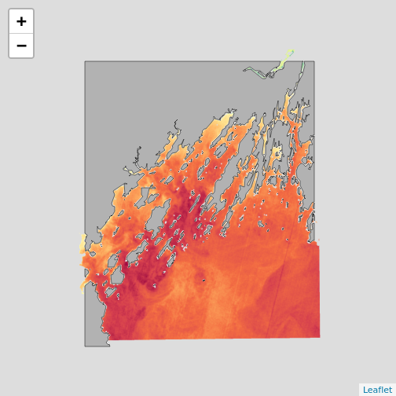

::::::::::::::::::::::::::::::::::::::: objectives

- Examine objects with different CRSs in the same plot.
- Reproject a raster and a vector layer in R.
- Plot vector and raster layers in the same plot.


::::::::::::::::::::::::::::::::::::::::::::::::::

:::::::::::::::::::::::::::::::::::::::: questions

- How do I work with data sets that are in different projections?

::::::::::::::::::::::::::::::::::::::::::::::::::


::::::::::::::::::::::::::::::::::::::::::  prereq

## Things You'll Need To Complete This Episode

See the [lesson homepage](.) for detailed information about the software, data,
and other prerequisites you will need to work through the examples in this
episode.


::::::::::::::::::::::::::::::::::::::::::::::::::

##  Projection in R


In [an earlier episodes](08-vector-plot-shapefiles-custom-legend/) we learned how to layer multiple vector data types. These principles extend to layering in raster
data. When combining multiple data sources, particularly from different agencies
or research efforts, we often find that they do not have the same 
Coordinate Reference System. This can be true of combining multiple vectors or
rasters, or both.  

We will apply our skills learned thus far to create maps that combine both the
coastline of Casco Bay (`casco_coastline`) with SST data from 2022 
(`b10_casco_2022`) and seagrass data (`seagrass_casco_2022`). We will learn how
to map vector data sources that are in different CRSs and thus don't
line up on a map.


## Load the Data

We will continue to use the `sf` and `terra` packages in this episode as well as others from previously.


```r
library(terra)
library(sf)
library(ggplot2)
library(tidyterra)
library(dplyr)
```

We will continue to work with the two ESRI `shapefiles` that we loaded in the
[previously](08-vector-plot-shapefiles-custom-legend/) as well as some Sea 
Surface Temperature data from [our raster lessons](01-raster-structure/).


```r
# Casco Bay SST from Sept 9, 2022
b10_casco_2022 <- rast(
  "data/landsat_casco/b10_cropped/LC08_L2SP_011030_20220909_20220914_02_T1_ST_B10.TIF")

# Seagrass beds in 2022
seagrass_casco_2022 <- st_read(
  "data/maine_gov_seagrass/MaineDEP_Casco_Bay_Seagrass_2022/MaineDEP_Casco_Bay_Seagrass_2022.shp")

# Casco Coastline
casco_coastline <- st_read(
  "data/maine_gov_maps/Maine_State_Boundary_Polygon_Feature/Maine_State_Boundary_Polygon_Feature.shp") |>
  st_make_valid() |>
  st_crop(seagrass_casco_2022)
```

## Working With Spatial Data From Different Sources

We often need to gather spatial datasets from different sources and/or data
that cover different spatial extents.
These data are often in different Coordinate Reference Systems (CRSs).

Some reasons for data being in different CRSs include:

1. The data are stored in a particular CRS convention used by the data provider
   (for example, a government agency).
2. The data are stored in a particular CRS that is customized to a region. For
   instance, many states in the US prefer to use a State Plane projection
   customized for that state.


Notice the differences in shape associated with each different projection.
These differences are a direct result of the calculations used to "flatten" the
data onto a 2-dimensional map. Often data are stored purposefully in a
particular projection that optimizes the relative shape and size of surrounding
geographic boundaries (states, counties, countries, etc).

In this episode we will learn how to identify and manage spatial data in
different projections. We will learn how to reproject the data so that they are
in the same projection to support plotting / mapping. Note that these skills
are also required for any geoprocessing / spatial analysis. Data need to be in
the same CRS to ensure accurate results.

## Inspecting CRS

To begin, how different are these two data sources? We can inspect their 
respective Coordinate Reference Systems to see.


```r
crs(b10_casco_2022, proj = TRUE)
```

```{.output}
[1] "+proj=utm +zone=19 +datum=WGS84 +units=m +no_defs"
```

```r
crs(casco_coastline, proj = TRUE)
```

```{.output}
[1] "+proj=longlat +datum=WGS84 +no_defs"
```

```r
# st_crs(casco_coastline)$proj4string #this also works
```


Our project string for `b10_casco_2022` specifies the UTM projection as follows:

`+proj=utm +zone=19 +datum=WGS84 +units=m +no_defs`

- **proj=utm:** the projection is UTM, UTM has several zones.
- **zone=19:** the zone is 19
- **datum=WGS84:** the datum WGS84 (the datum refers to the  0,0 reference for
  the coordinate system used in the projection)
- **units=m:** the units for the coordinates are in METERS.
- **no_defs:** nothing is used from detault files.

Note that the `zone` is unique to the UTM projection. Not all CRSs will have a
zone.


For `casco_coastline`


Our project string for `casco_coastline`  specifies
the lat/long projection as follows:

`+proj=longlat +datum=WGS84 +no_defs`


- **proj=longlat:** the data are in a geographic (latitude and longitude)
  coordinate system
- **datum=WGS84:** the datum WGS84 (the datum refers to the  0,0 reference for
  the coordinate system used in the projection)
- **no_defs:** nothing is used from detault files.

Note that there are no specified units above. This is because this geographic
coordinate reference system is in latitude and longitude which is most often
recorded in decimal degrees.

Sometimes you will also see  **ellps=WGS84:** the ellipsoid (how the earth's roundness is calculated)  is WGS84.

The projections are very different. Refer to UTM versus UTM in the
figure of the US above.


:::::::::::::::::::::::::::::::::::::::::  callout

## Data Tip

the last portion of each `proj4` string could potentially be something like
`+towgs84=0,0,0 `. This is a conversion factor that is used if a datum
conversion is required. We will not deal with datums in this episode series.


::::::::::::::::::::::::::::::::::::::::::::::::::

## Do We Need to Reproject?

We can begin by trying to plot these datasets together. One of the nice things 
about `tidyterra` and how `ggplot2` works with `sf` objects is that it projects
them to the same CRS. So, if we try and plot these data sources together:


```r
ggplot() +
  geom_spatraster(data = b10_casco_2022) +
  geom_sf(data = casco_coastline) + 
  scale_fill_viridis_c() 
```


This looks pretty good. Leaflet looks good as well.


```r
library(leaflet)

leaflet() |>
  addPolygons(data = casco_coastline,
              fill = "white", weight = 1, 
              color = "black") |>
  addRasterImage(b10_casco_2022)
```



But, note two things. First, not every plotting algorithm will work. For example
if we went old school and used `plot()` with `add=TRUE` to add a layer, this 
would have failed. Here we see if putting a different layer down as the base.


```r
par(mfrow = c(1,2))

plot(b10_casco_2022, main = "SST First")
plot(casco_coastline$geometry, add = TRUE)

plot(casco_coastline$geometry, main = "Coastline First", axes = TRUE)
plot(b10_casco_2022, add = TRUE)
```


```r
par(mfrow = c(1,1))
```

Where did the other layer go? The axes give away that it's a projection problem.

Second, in  both of these, the borders and the raster don't line up. So we want 
to line up extents. This is an aesthetic concern, but can be a big one - 
particularly if we were doing operations other than plotting. We need to crop
one data set by the other.

## Cropping and CRS

Cropping involves cutting off one part of an object to match another. It is one 
of the operations we use to subset data spatially. We can also extend objects 
to add rows or columns or mask out parts of an object. In this case, let's crop
`b10_casco_2022` so that we get rid of that NA edge. After, we can crop the 
the coastline in order to eliminate that weird hang-on piece of coast at the 
bottom of the maps. 

As we are cropping a `terra` `SpatRaster` object, we will use `crop()` which
takes an input raster and then an object with an extent to crop it to.


```r
b10_casco_2022_cropped <- crop(b10_casco_2022, 
                               casco_coastline)
```

```{.error}
Error: [crop] extents do not overlap
```

Well that's odd.  What are their extents?


```r
ext(b10_casco_2022)
```

```{.output}
SpatExtent : 398865, 432705, 4825935, 4866405 (xmin, xmax, ymin, ymax)
```

```r
ext(casco_coastline)
```

```{.output}
SpatExtent : -70.244637867776, -69.843989726984, 43.5721328168498, 43.9322969014411 (xmin, xmax, ymin, ymax)
```

Those are very different numbers due to their different CRS's that we looked at 
above. This means, we will have to REPROJECT one of the two objects in order to
crop it successfully, and then work in a common CRS.


:::::::::::::::::::::::::::::::::::::::::  callout

## Which data source should I reproject?

Projection works on a pixel by pixel basis. That means that for every
pixel in your data, your computer will be doing work. As your data sets
increase in size, projection can be computationally very expensive. In
these cases, think about which layer will process faster. Often, it's 
faster to project vector data, as it contains a tiny fraction of the 
points that are found in a raster data set.

::::::::::::::::::::::::::::::::::::::::::::::::::


While we can write a long CRS string, it's easier to just take it from an
object or specify what's called an EPSG code from [epsg.org](https://epsg.org/home.html). We can see those codes using `crs()` 
from terra with `describe = TRUE`


```r
crs(casco_coastline, describe = TRUE)
```

```{.output}
    name authority code area         extent
1 WGS 84      EPSG 4326 <NA> NA, NA, NA, NA
```

From this we can see the EPSG code is [4326](https://epsg.io/4326).

For the SST data...


```r
crs(b10_casco_2022, describe = TRUE)
```

```{.output}
                   name authority  code
1 WGS 84 / UTM zone 19N      EPSG 32619
                                                                                                                                                                                                                                                                                                                         area
1 Between 72°W and 66°W, northern hemisphere between equator and 84°N, onshore and offshore. Aruba. Bahamas. Brazil. Canada - New Brunswick (NB); Labrador; Nunavut; Nova Scotia (NS); Quebec. Colombia. Dominican Republic. Greenland. Netherlands Antilles. Puerto Rico. Turks and Caicos Islands. United States. Venezuela
           extent
1 -72, -66, 84, 0
```

the EPSG code is [32619](https://epsg.io/32619).

Regardless, we can reproject the raster to the same projection as the coastline.


```r
b10_casco_2022_4326 <- project(b10_casco_2022,
                               crs(casco_coastline))

b10_casco_2022_4326
```

```{.output}
class       : SpatRaster 
dimensions  : 1159, 1343, 1  (nrow, ncol, nlyr)
resolution  : 0.0003176554, 0.0003176554  (x, y)
extent      : -70.26025, -69.83364, 43.57953, 43.94769  (xmin, xmax, ymin, ymax)
coord. ref. : lon/lat WGS 84 (EPSG:4326) 
source(s)   : memory
name        : SST_F_20220909 
min value   :       63.06477 
max value   :       79.34391 
```

Note the difference in information about the projection (and EPSG code). 

To transform `sf` vector data, we would have used the function `st_transform()`.


:::::::::::::::::::::::::::::::::::::::::  callout

## Proj4 \& CRS Resources

- [Official PROJ library documentation](https://proj4.org/)
- [More information on the proj4 format.](https://proj.maptools.org/faq.html)
- [A fairly comprehensive list of CRSs by format.](https://spatialreference.org)
- To view a list of datum conversion factors type:
  `sf_proj_info(type = "datum")` into the R console. However, the results would
  depend on the underlying version of the PROJ library.


::::::::::::::::::::::::::::::::::::::::::::::::::

## Cropping and Plotting

Now we can crop. We will first crop the SST raster to the coastline in 
order to get rid of the NA area in the raster.


```r
b10_casco_2022_4326_cropped <- crop(b10_casco_2022_4326,
                                    casco_coastline)
```

 Then we will crop the coastline 
to the cropped raster in order to get rid of that little bit of coast on the 
southern end.


```r
casco_coastline_cropped <- st_crop(casco_coastline,
                                   b10_casco_2022_4326_cropped)
```

Let's plot it and see if all of the effort was worth it!


```r
ggplot() +
  geom_spatraster(data = b10_casco_2022_4326_cropped) +
  geom_sf(data = casco_coastline_cropped, fill = "tan") + 
  scale_fill_viridis_c() +
  labs(fill = "SST (F)") +
  coord_sf(expand = FALSE)
```


## Summary: When CRS Attacks

The workflow outlined here, while in depth, is actually relatively simple. 
When you have two or more spatial data sets that you want to line up in terms
of extent and projection.

0. Determine if they actually differ in projection. If not, skip to 2.
1. Reproject the smaller data source to the CRS of the larger one (if size is a concern).
2. Crop back and forth to line up extents.
3. Plot!

:::::::::::::::::::::::::::::::::::::::  challenge

## Challenge - Show us the temperature of seagrass beds

Let's combine our SST and Seagrass data from 2022 to see if seagrasses are in 
warm places around Mackworth. Let's start by making a Macworth Island AOI. 
We will do this by making a bounding box, and then turning it into an sf object.


```r
mackworth_aoi <- st_bbox(c(xmin = -70.24768051612979, 
                           xmax = -70.19432151530208,
                           ymin = 43.66353031177649, 
                           ymax = 43.714022044471584),
                         crs = 4326) |>
  st_as_sfc()
```

1. Reproject the AOI  and seagrass data to the same projection as the SST raster. Note, to get the CRS in a format `sf` recognizes, use `st_crs()`. We can leave out the coast.

2. Crop everything to the Mackworth AOI. Note, `sf` uses `st_crop()` while `terra` uses `crop`.

3. Plot! Try leaving seagrass polygons with an `NA` fill to see the temperature
inside and outside of the beds. As land is NA here, you can use the `na.value` argument to your `scale_fill_*()` to make the land tan.

:::::::::::::::  solution

## Answers


1. Reprojection


```r
seagrass_casco_2022_32619 <- st_transform(seagrass_casco_2022, 
                                          st_crs(b10_casco_2022))

mackworth_32619 <- st_transform(mackworth_aoi, 
                              st_crs(b10_casco_2022))
```


2. Cropping


```r
seagrass_casco_2022_32619_mackworth <- st_crop(seagrass_casco_2022_32619,
                                               mackworth_32619)

b10_casco_2022_mackworth <- crop(b10_casco_2022,
                                 mackworth_32619)
```

3. Plot!


```r
ggplot() +
  geom_spatraster(data = b10_casco_2022_mackworth) +
  geom_sf(data = seagrass_casco_2022_32619_mackworth, 
          color = "black",
          linewidth = 1,
          fill = NA) +
  scale_fill_viridis_c(na.value = "tan") +
  coord_sf(expand = FALSE)
```


Looks like they are not in the warmest spots, but generally waters that in this
Landsat scene were a bit cooler.
:::::::::::::::::::::::::

::::::::::::::::::::::::::::::::::::::::::::::::::


:::::::::::::::::::::::::::::::::::::::: keypoints

- Multi-layered plots can combine vector and raster data sets.
- `ggplot2` automatically converts all objects in a plot to the same CRS.
- Still be aware of the CRS and extent for each object.
- `project()` and `st_transform()` will reproject raster and vector data.
- `crop()` and `st_crop()` will crop raster and vector data.
::::::::::::::::::::::::::::::::::::::::::::::::::


