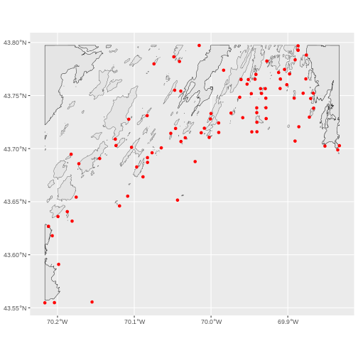
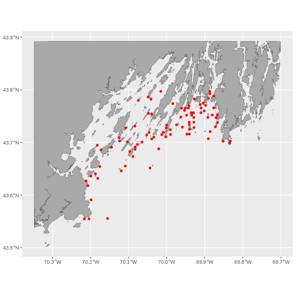

```{.warning}
Warning in
download.file("https://www.naturalearthdata.com/http//www.naturalearthdata.com/download/110m/physical/ne_110m_graticules_all.zip",
: cannot open URL
'https://www.naturalearthdata.com/http//www.naturalearthdata.com/download/110m/physical/ne_110m_graticules_all.zip':
HTTP status was '500 Internal Server Error'
```

```{.error}
Error in download.file("https://www.naturalearthdata.com/http//www.naturalearthdata.com/download/110m/physical/ne_110m_graticules_all.zip", : cannot open URL 'https://www.naturalearthdata.com/http//www.naturalearthdata.com/download/110m/physical/ne_110m_graticules_all.zip'
```

::::::::::::::::::::::::::::::::::::::: objectives

- Import .csv files containing x,y coordinate locations into R as a data frame.
- Convert a data frame to a spatial object.
- Export a spatial object to a text file.

::::::::::::::::::::::::::::::::::::::::::::::::::

:::::::::::::::::::::::::::::::::::::::: questions

- How can I import CSV files as vector layers in R?

::::::::::::::::::::::::::::::::::::::::::::::::::


::::::::::::::::::::::::::::::::::::::::::  prereq

## Things You'll Need To Complete This Episode

See the [lesson homepage](.) for detailed information about the software, data,
and other prerequisites you will need to work through the examples in this
episode.
 
You'll need to load the following libraries


```r
library(ggplot2)
library(dplyr)
library(sf)
```

::::::::::::::::::::::::::::::::::::::::::::::::::

This episode will review how to import spatial points stored in `.csv` (Comma
Separated Value) format into R as an `sf` spatial object. We will also
 plot it and save the data as an ESRI `shapefile`.

## Spatial Data in Text Format

In the [Intro to R for Geospatial](https://cobalt-casco.github.io/r-intro-geospatial/) lessons, we 
worked with data from [Maine DMR urchin surves](https://www.maine.gov/dmr/science/species-information/green-sea-urchins) 
and Steneck/Rasher lab surveys of kelp forests up and down the coast of Maine. 
This data  contains `x, y` (point) locations for study sites in the form of the 
variables `longitude` and `latitude`.

We would like to:

- Create a map of these site locations.
- Create a map showing the coastline as a reference
- Export the data in an ESRI `shapefile` format to share with our colleagues. This
  `shapefile` can be imported into most GIS software.

Spatial data are sometimes stored in a text file format (`.txt` or `.csv`). If
the text file has an associated `x` and `y` location column, then we can
convert it into an `sf` spatial object. The `sf` object allows us to store both
the `x,y` values that represent the coordinate location of each point and the
associated attribute data - or columns describing each feature in the spatial
object.


## Import .csv

To begin let's import a `.csv` file that contains site coordinate locations
from these  subtidal locations and look at the structure of that new object:


```r
dmr <- 
  read.csv("data/maine_dmr/dmr_kelp_urchin.csv")

str(dmr)
```

```{.output}
'data.frame':	1478 obs. of  15 variables:
 $ year         : int  2001 2001 2001 2001 2001 2001 2001 2001 2001 2001 ...
 $ region       : chr  "York" "York" "York" "York" ...
 $ exposure.code: int  4 4 4 4 4 2 2 3 2 2 ...
 $ coastal.code : int  3 3 3 4 3 2 2 3 2 2 ...
 $ latitude     : num  43.1 43.3 43.4 43.5 43.5 ...
 $ longitude    : num  -70.7 -70.6 -70.4 -70.3 -70.3 ...
 $ depth        : int  5 5 5 5 5 5 5 5 5 5 ...
 $ crust        : num  60 75.5 73.5 63.5 72.5 6.1 31.5 31.5 40.5 53 ...
 $ understory   : num  100 100 80 82 69 38.5 74 96.5 60 59.5 ...
 $ kelp         : num  1.9 0 18.5 0.6 63.5 92.5 59 7.7 52.5 29.2 ...
 $ urchin       : num  0 0 0 0 0 0 0 0 0 0 ...
 $ month        : int  6 6 6 6 6 6 6 6 6 6 ...
 $ day          : int  13 13 14 14 14 15 15 15 8 8 ...
 $ survey       : chr  "dmr" "dmr" "dmr" "dmr" ...
 $ site         : int  42 47 56 61 62 66 71 70 23 22 ...
```

We now have a data frame that contains 1478 locations (rows) and 15 variables
(attributes). Note that all of our character data was imported into R as
character (text) data. Next, let's explore the dataframe to determine whether
it contains columns with coordinate values. If we are lucky, our `.csv` will
contain columns labeled:

- "X" and "Y" OR
- Latitude and Longitude OR
- easting and northing (UTM coordinates)

Let's check out the column names of our dataframe.


```r
names(dmr)
```

```{.output}
 [1] "year"          "region"        "exposure.code" "coastal.code" 
 [5] "latitude"      "longitude"     "depth"         "crust"        
 [9] "understory"    "kelp"          "urchin"        "month"        
[13] "day"           "survey"        "site"         
```

## Identify X,Y Location Columns

Our column names include several fields that might contain spatial information.
The `dmr$longitude` and `dmr$latitude` columns
contain coordinate values. We can confirm this by looking at the first six rows
of our data.


```r
head(dmr$longitude)
```

```{.output}
[1] -70.66749 -70.55645 -70.38046 -70.32038 -70.30401 -70.10721
```

```r
head(dmr$latitude)
```

```{.output}
[1] 43.06709 43.28014 43.40849 43.50783 43.52791 43.72766
```

We have coordinate values in our data frame. In order to convert our data frame
to an `sf` object, we also need to know the CRS associated with those
coordinate values.

There are several ways to figure out the CRS of spatial data in text format.

1. We can check the file metadata in hopes that the CRS was recorded in the
  data.
2. We can explore the file itself to see if CRS information is embedded in the
  file header or somewhere in the data columns.

In our case, as we have decimal degrees, this is likely a standard WGS 84 
defined under EPSG code 4326. However, it always behoves you to check!

If we had had columns like  `easting` and `northing` columns, 
then we are likely dealing with UTM or otherwise. Check if there is a 
`geodeticDatum` and a `utmZone` column. These appear to contain CRS information (`datum` and `projection`). Or, again, check the metadata for the data set.

In
[When Vector Data Don't Line Up - Handling Spatial Projection \& CRS in R](09-vector-when-data-dont-line-up-crs/)
we learned about the components of a `proj4` string and `EPSG`. 
We have everything we need to assign a CRS to our data frame. If we wanted,
we could use another loaded shapefile to extract a CRS and use it here. That
is not needed, however, as `sf` lets us use EPSG codes.


## .csv to sf object

Let's convert our dataframe into an `sf` object. To do this, we need to
specify:

1. The columns containing X (`longitude`) and Y (`latitude`) coordinate values
2. The CRS. Either as an object or an EPSG code.

We will use the `st_as_sf()` function to perform the conversion.


```r
dmr_sf <- st_as_sf(dmr,
                   coords = c("longitude", "latitude"),
                   crs = 4326)
```

We should double check the CRS to make sure it is correct.


```r
st_crs(dmr_sf)
```

```{.output}
Coordinate Reference System:
  User input: EPSG:4326 
  wkt:
GEOGCRS["WGS 84",
    ENSEMBLE["World Geodetic System 1984 ensemble",
        MEMBER["World Geodetic System 1984 (Transit)"],
        MEMBER["World Geodetic System 1984 (G730)"],
        MEMBER["World Geodetic System 1984 (G873)"],
        MEMBER["World Geodetic System 1984 (G1150)"],
        MEMBER["World Geodetic System 1984 (G1674)"],
        MEMBER["World Geodetic System 1984 (G1762)"],
        MEMBER["World Geodetic System 1984 (G2139)"],
        ELLIPSOID["WGS 84",6378137,298.257223563,
            LENGTHUNIT["metre",1]],
        ENSEMBLEACCURACY[2.0]],
    PRIMEM["Greenwich",0,
        ANGLEUNIT["degree",0.0174532925199433]],
    CS[ellipsoidal,2],
        AXIS["geodetic latitude (Lat)",north,
            ORDER[1],
            ANGLEUNIT["degree",0.0174532925199433]],
        AXIS["geodetic longitude (Lon)",east,
            ORDER[2],
            ANGLEUNIT["degree",0.0174532925199433]],
    USAGE[
        SCOPE["Horizontal component of 3D system."],
        AREA["World."],
        BBOX[-90,-180,90,180]],
    ID["EPSG",4326]]
```

## Plot Spatial Object

We now have a spatial R object, we can plot our newly created spatial object.


```r
ggplot() +
  geom_sf(data = dmr_sf,
          mapping = aes(color = region)) +
  ggtitle("Map of Site Locations")
```


Looks good! If we really want to check, we can either load up our state of
Maine shapefile or plot it against a tiles with `leaflet`.


```r
library(leaflet)

pal <- colorFactor("Set1",
                   domain = dmr_sf$region)

leaflet() |>
  addTiles() |>
  addCircles(data = dmr_sf,
             color = ~pal(region))
```


:::::::::::::::::::::::::::::::::::::::  challenge

## Challenge - Import \& Plot Additional Points

Load just Casco Bay and plot it along with the Maine coastal shapefile.
Use the Casco data to crop the Maine shapefile and plot them together.

:::::::::::::::  solution

## Answers


```r
# Load Casco
casco_dmr <- read.csv(
  "data/maine_dmr/casco_kelp_urchin.csv"
)


# Turn it into an sf object
casco_dmr_sf <- st_as_sf(casco_dmr,
                         coords = c("longitude", "latitude"),
                         crs = 4326)

# Load Maine
maine <- st_read(
  "data/maine_gov_maps/Maine_State_Boundary_Polygon_Feature/Maine_State_Boundary_Polygon_Feature.shp",
  quiet = TRUE)

# Crop to Casco
casco <- st_crop(maine |> st_make_valid(), 
                 casco_dmr_sf)

# Plot!
ggplot() +
  geom_sf(data = casco) +
  geom_sf(data = casco_dmr_sf, color = "red")
```



:::::::::::::::::::::::::

::::::::::::::::::::::::::::::::::::::::::::::::::

:::::::::::::::::::::::::::::::::::::::: keypoints
Sometimes, we want to crop to a larger area than just the data set. For that,
we can create a box from the extent of the new vector object using `st_bbox()`.
This, though, is really just a vector, so we need to turn it into a polygon
using `st_sfc()` (sfc objects are just a raw shape, while sf contains data).

To make this box bigger, we can use `st_buffer()` which will create a buffer 
area using a distance specified in meters. So, `1e4` would be 10km.

This technique can be a nice way to put a new vector file in context, as follows.


```r
#Make a bounding box of the Casco Bay area from the data
casco_bbox <- st_bbox(casco_dmr_sf) |>
  st_as_sfc()

# Enlarge it by 10 km
casco_bbox_big <- st_buffer(casco_bbox, 
                            dist = 1e4)

# Crop to the new area
casco <- st_crop(maine |> st_make_valid(), 
                 casco_bbox_big)

# Plot!
ggplot() +
  geom_sf(data = casco, fill = "darkgrey") +
  geom_sf(data = casco_dmr_sf, color = "red")
```



:::::::::::::::::::::::::::::::::::::::: 

## Export to an ESRI `shapefile`

We can write an R spatial object to an ESRI `shapefile` using the `st_write` function
in `sf`. To do this we need the following arguments:

- the name of the spatial object (`dmr_sf`)
- the directory where we want to save our ESRI `shapefile` (to use `current = getwd()`  or you can specify a different path). You can also use `dir.create()`
no make a new directory.
- the name of the new ESRI `shapefile` (`dmr_kelp_urchins`)
- the driver which specifies the file format (ESRI Shapefile)

We can now export the spatial object as an ESRI `shapefile`. Note - this will 
make a few files.


```r
dir.create("data/dmr_kelp_urchins")
st_write(dmr_sf,
         "data/dmr_kelp_urchins/dmr_kelp_urchins.shp", driver = "ESRI Shapefile")
```


:::::::::::::::::::::::::::::::::::::::: keypoints

- Know the projection (if any) of your point data prior to converting to a
  spatial object.
- Convert a data frame to an `sf` object using the `st_as_sf()` function.
- Export an `sf` object as text using the `st_write()` function.

::::::::::::::::::::::::::::::::::::::::::::::::::


